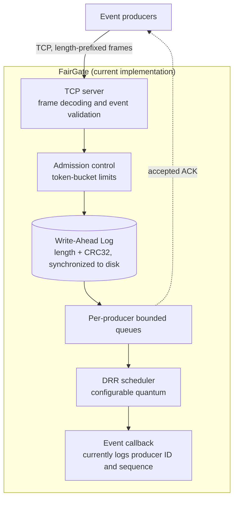
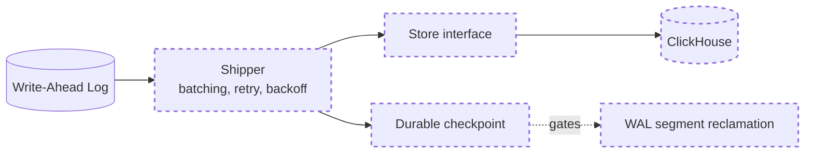
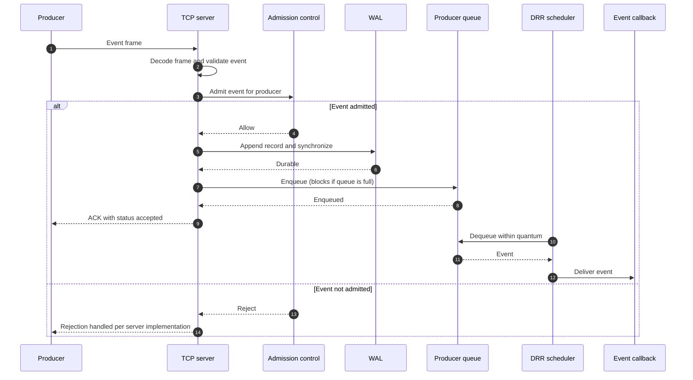
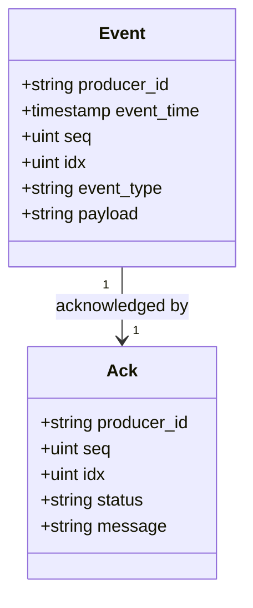
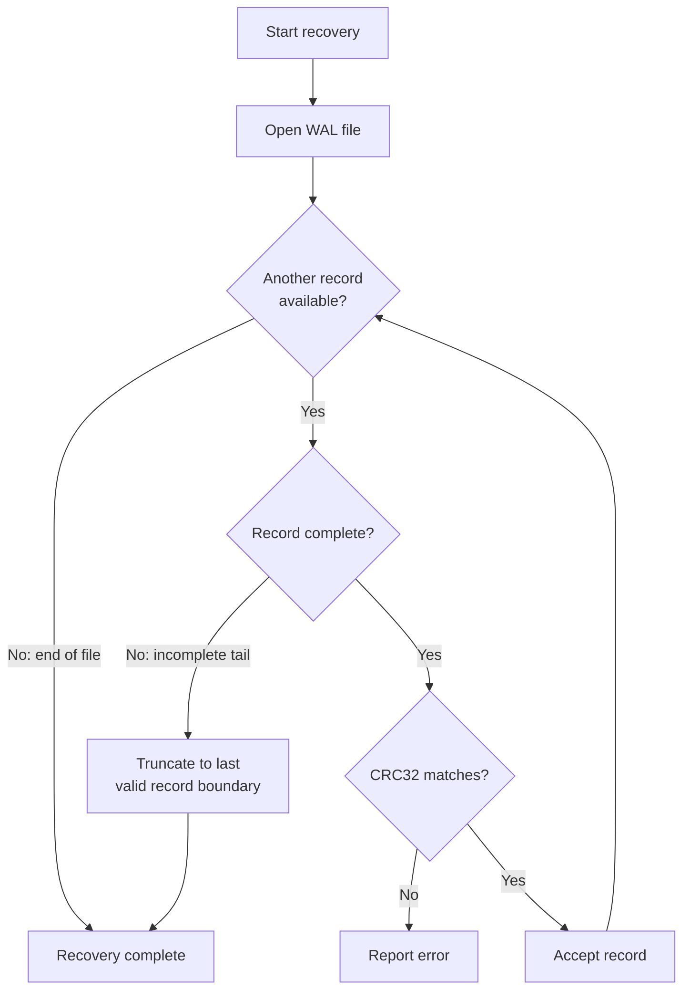
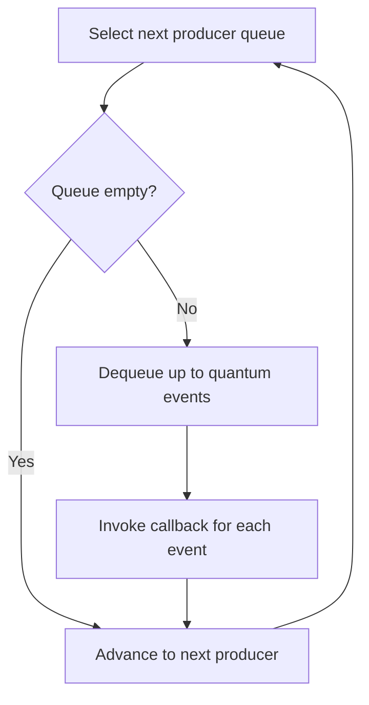
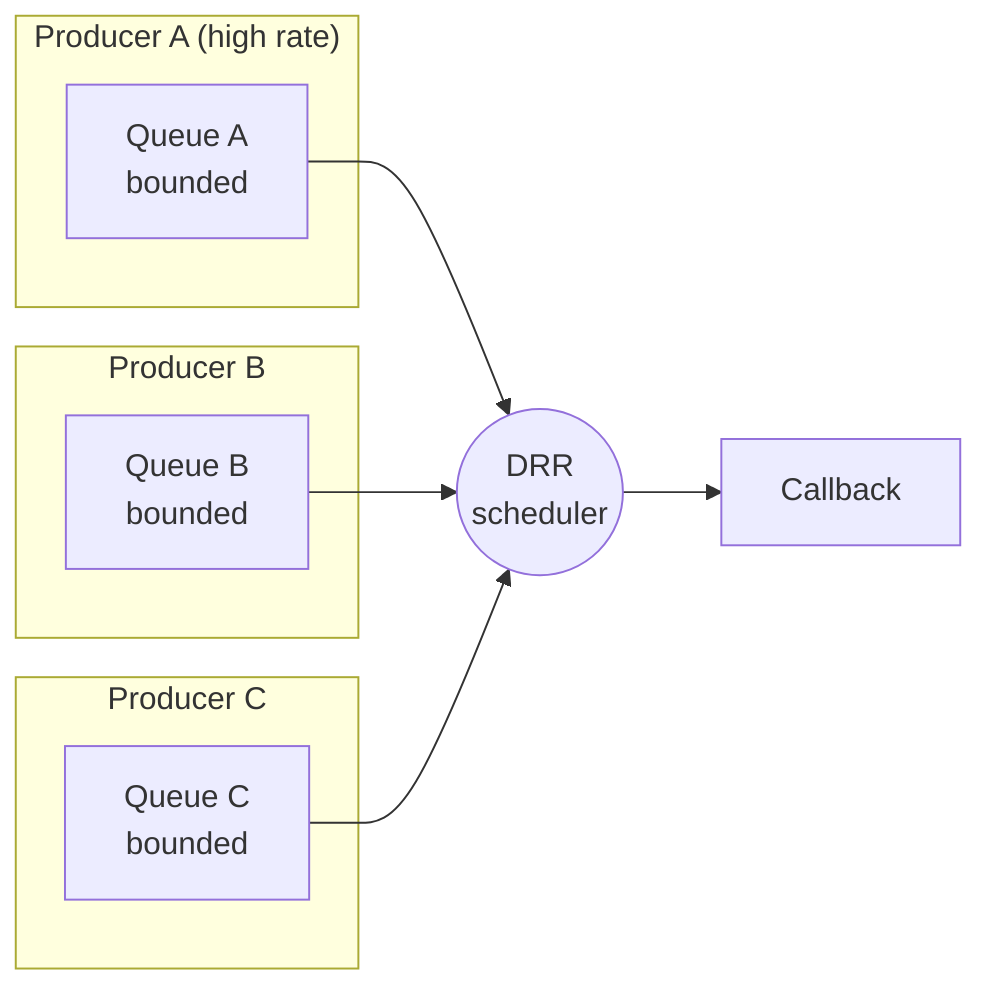
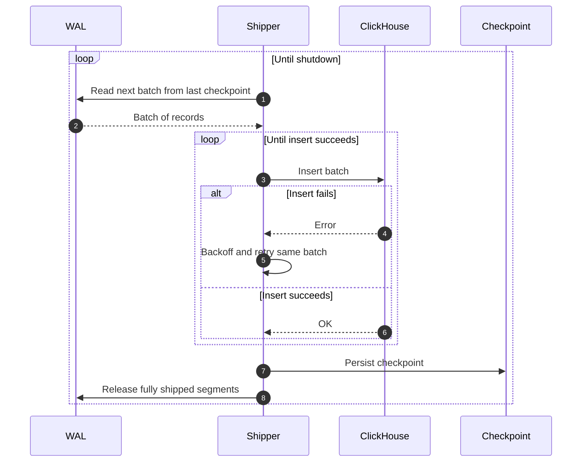

# FairGate

**A fair-share event ingestion gateway written in Go.**

FairGate is a modular event-ingestion gateway. It accepts framed event streams over TCP, applies admission control, persists accepted events in a Write-Ahead Log (WAL), and schedules events from per-producer queues using Deficit Round Robin (DRR).

The project explores fair resource sharing in event-ingestion systems: keeping producers isolated from one another through bounded buffering, admission limits, and fair scheduling. FairGate is being developed as an open-source foundation that can be extended with different storage backends and downstream processing components.

> [!IMPORTANT]
> **Beta status.** FairGate is under active development. The current implementation provides TCP ingestion, event decoding and validation, admission control, per-producer bounded queues, DRR scheduling, WAL append and recovery, and acknowledgments. The ClickHouse shipper, checkpointing, advanced overload control, and production observability described in the roadmap are not yet integrated into the current ingestion path.

## Table of Contents

- [Design goals](#design-goals)
- [Features](#features)
- [Architecture](#architecture)
- [Event lifecycle](#event-lifecycle)
- [Event model](#event-model)
- [Wire protocol](#wire-protocol)
- [Write-Ahead Log](#write-ahead-log)
- [Backpressure and scheduling](#backpressure-and-scheduling)
- [Delivery semantics](#delivery-semantics)
- [Configuration](#configuration)
- [Planned storage integration](#planned-storage-integration)
- [Roadmap](#roadmap)
- [Project structure](#project-structure)
- [Getting started](#getting-started)
- [Development status and limitations](#development-status-and-limitations)
- [Contributing](#contributing)
- [License](#license)

## Design goals

| Goal | Approach |
|---|---|
| Producer isolation | Each producer has its own bounded queue, so one producer cannot consume another producer's buffer space. |
| Fair service | DRR scheduling visits producer queues in rounds and serves a bounded amount from each. |
| Bounded resource usage | Every queue has an explicit capacity, and a full queue applies backpressure instead of growing. |
| Durability before acknowledgment | Events are appended to the WAL and synchronized to disk before an acknowledgment is sent. |
| Extensibility | Core ingestion and scheduling are independent of event meaning. Storage and processing attach through well-defined seams. |

## Features

### Currently implemented

- **TCP event ingestion.** Accepts client connections and reads length-prefixed frames.
- **Framed wire protocol.** Identifies event and acknowledgment frames using frame types.
- **JSON event decoding.** Decodes events and checks required fields.
- **Admission control.** Applies token-bucket-based limits to incoming events.
- **Per-producer queues.** Keeps producer events in separate bounded channels.
- **DRR scheduling.** Selects queued events in producer rounds using a configurable quantum.
- **Write-Ahead Log.** Appends events with length and CRC metadata and synchronizes records to disk.
- **WAL recovery.** Scans persisted records on startup and handles incomplete trailing records.
- **Acknowledgments.** Sends an accepted acknowledgment after the event has been appended to the WAL and enqueued.
- **Concurrent connections.** Handles client connections in separate goroutines.
- **Tests.** Includes unit and integration tests for core behavior.

### Planned

- Asynchronous WAL shipper and batch delivery
- Pluggable storage interface and ClickHouse adapter
- Durable shipper checkpoints, retry and backoff, and WAL segment lifecycle
- Configurable producer weights and richer fairness controls
- Backlog-aware overload handling and load shedding
- Prometheus metrics, profiling endpoints, and dashboards
- Load-generation, reconciliation, and chaos-testing tools
- Graceful coordinated shutdown and additional protocol hardening

Planned capabilities are not implied to be available in this beta.

## Architecture

### Current implementation

The diagram below shows the ingestion path as implemented today.



Accepted events are appended to the WAL before they are enqueued and acknowledged to the client. The current scheduler callback logs the selected event's producer ID and sequence number. A pluggable event-processing interface and storage adapters are part of the planned modular architecture.

### Planned extension

The shipper, store abstraction, and ClickHouse adapter are not yet part of the ingestion path. Dashed elements below are planned.



### Component responsibilities

| Package | Responsibility |
|---|---|
| `internal/server` | TCP listener, per-connection goroutines, frame handling, acknowledgment delivery. |
| `internal/wire` | Frame codec, event and acknowledgment types, validation. |
| `internal/admit` | Token-bucket admission control. |
| `internal/sched` | Per-producer bounded queues and the DRR scheduler. |
| `internal/wal` | WAL append, synchronization, and recovery. |

## Event lifecycle

The sequence below shows the path of a single event through the current implementation.



An `accepted` ACK reflects WAL durability and queue admission. It does not reflect downstream storage. See [Delivery semantics](#delivery-semantics).

## Event model

Events are represented as JSON with the following fields:

```json
{
  "producer_id": "sensor-01",
  "event_time": "2026-10-02T08:00:00Z",
  "seq": 1,
  "idx": 0,
  "event_type": "temperature",
  "payload": "{\"value\":24.7}"
}
```

| Field | Type | Description |
|---|---|---|
| `producer_id` | string | Identifier of the event producer |
| `event_time` | timestamp | Event timestamp |
| `seq` | unsigned integer | Producer sequence number |
| `idx` | unsigned integer | Event index |
| `event_type` | string | Event category |
| `payload` | string | Event payload |

The decoder requires a non-empty producer ID, a non-zero event time, and a non-empty event type.



The `message` field of an acknowledgment is optional.

## Wire protocol

FairGate uses a length-prefixed frame format:

```text
+----------------------+----------------+----------------+------------------+
| Length (4 bytes)     | Type (1 byte)  | Flags (1 byte) | Payload          |
| Big-endian           |                |                | Variable length  |
+----------------------+----------------+----------------+------------------+
```

The current frame types are:

| Type | Purpose |
|---|---|
| `1` | Event |
| `2` | Acknowledgment (ACK) |

An ACK contains the producer ID, sequence number, event index, status, and an optional message. An `accepted` ACK indicates that the event was written to the WAL and enqueued. It does **not** indicate that a downstream database has stored or queried the event.

Refer to the `wire` package for the current protocol implementation and exact encoding behavior.

## Write-Ahead Log

The WAL stores serialized event records with a length field and a CRC32 checksum. The layout below is conceptual. Refer to the `wal` package for the exact encoding.

```text
+----------------+----------------+---------------------------+
| Length         | CRC32          | Serialized event          |
+----------------+----------------+---------------------------+
```

### Recovery

On startup the WAL is scanned record by record. Incomplete trailing records are truncated to the last valid record boundary. Corrupt records and checksum mismatches are reported as errors.



The current implementation uses a single WAL file and recovers its events during startup. Segmented WAL files, group commit, shipper checkpoints, and automated segment reclamation are planned extensions.

## Backpressure and scheduling

Each producer has its own bounded queue. The queue capacity is configured when the queue manager is created, and the server currently uses 256 events per producer. Enqueueing blocks when a producer's queue is full, applying backpressure to the caller instead of allowing the queue to grow without bound.

The DRR scheduler visits producer queues and processes available events up to its configured quantum (currently 8 in the server). The scheduler is independent of event meaning, and its callback is responsible for downstream handling. At this beta stage, the callback only logs events.





Because each queue is separate and bounded, a high-rate producer fills only its own queue. Other producers continue to be served in each scheduling round.

## Delivery semantics

| Property | Current beta |
|---|---|
| Event persisted to the WAL before acknowledgment | Yes |
| Acknowledgment sent after enqueue | Yes |
| Per-producer memory bounded | Yes, by queue capacity |
| Persisted records scanned on restart | Yes |
| Events shipped to a database | No (planned) |
| Acknowledgment implies database storage | No |
| End-to-end exactly-once delivery | No |

Do not treat the current beta as a production-ready, exactly-once event delivery system.

## Configuration

The following values are currently fixed in the server and are expected to become configurable.

| Setting | Current value | Description |
|---|---|---|
| Queue capacity | 256 events per producer | Bound on each producer's queue. |
| DRR quantum | 8 | Maximum events served from a producer queue per visit. |

## Planned storage integration

ClickHouse is the intended initial storage backend. The project plan includes a `Store` abstraction and a ClickHouse adapter, with an asynchronous shipper that reads from the WAL, batches records, retries failed inserts, and persists checkpoints.

> [!NOTE]
> **The current beta does not yet ship WAL events to ClickHouse automatically.** Having a ClickHouse database or table available does not by itself connect it to the current event path.

### Intended shipper ordering

The intended design decouples producer acknowledgments from database availability: producers are acknowledged on WAL durability, and the shipper delivers to the database asynchronously. The checkpoint is written only after a batch insert succeeds.



### Duplicate handling

A crash between a successful insert and the checkpoint write would cause the same batch to be inserted again after restart. The planned design addresses this with an idempotent table definition keyed on a unique event identity, so repeated inserts converge to a single row. Exact-count queries would need to account for merge timing until deduplication completes. Batch delivery, retry behavior, checkpoint ordering, and duplicate handling must be implemented and validated before database delivery guarantees are documented.

### Target schema (planned)

The existing `fairgate.events` schema can be maintained as the target schema for the adapter. The definition below is illustrative of the intended direction and may change.

```sql
CREATE TABLE IF NOT EXISTS fairgate.events (
    producer_id  LowCardinality(String),
    seq          UInt64,
    idx          UInt32,
    event_time   DateTime64(3, 'UTC'),
    ingest_time  DateTime64(3, 'UTC'),
    event_type   LowCardinality(String),
    payload      String CODEC(ZSTD(3)),
    wal_segment  UInt64,
    wal_offset   UInt64
) ENGINE = ReplacingMergeTree
PARTITION BY toDate(ingest_time)
ORDER BY (producer_id, event_time, seq, idx);
```

## Roadmap

The roadmap lists planned work in dependency order. Items are subject to change.

```mermaid
flowchart LR
    subgraph DONE["Implemented"]
        direction TB
        D1["TCP ingestion and wire protocol"]
        D2["Admission control"]
        D3["Per-producer queues and DRR"]
        D4["WAL append and recovery"]
    end

    subgraph NEXT["Next"]
        direction TB
        N1["Store interface"]
        N2["WAL shipper and batching"]
        N3["ClickHouse adapter"]
        N4["Checkpoints and retry"]
    end

    subgraph LATER["Later"]
        direction TB
        L1["Producer weights"]
        L2["Overload control and load shedding"]
        L3["Metrics and profiling"]
        L4["Load, reconcile, and chaos tools"]
        L5["Graceful shutdown and protocol hardening"]
    end

    DONE --> NEXT --> LATER
```



| Area | Status |
|---|---|
| Ingestion, validation, admission control | Implemented |
| Per-producer queues, DRR scheduling | Implemented |
| WAL append and recovery | Implemented |
| WAL segmentation and group commit | Planned |
| Shipper, store abstraction, ClickHouse adapter | Planned |
| Checkpoints, retry, backoff | Planned |
| Producer weights and richer fairness controls | Planned |
| Backlog-aware overload handling | Planned |
| Metrics, profiling, dashboards | Planned |
| Load generator, reconciliation, chaos tooling | Planned |
| Graceful shutdown, protocol hardening | Planned |

## Project structure

```text
FairGate/
├── internal/
│   ├── admit/       # Admission control
│   ├── sched/       # Producer queues and DRR scheduler
│   ├── server/      # TCP listener and connection handling
│   ├── wal/         # WAL append and recovery
│   └── wire/        # Frame codec, event and ACK types
├── data/            # Local WAL data (runtime; do not commit)
├── go.mod
└── README.md
```

This reflects the current core packages. Additional packages and commands may be added as development continues.

## Getting started

### Requirements

- Go toolchain compatible with the version declared in `go.mod`
- Git

### Installation

```bash
git clone https://github.com/PratyushVishal11011/Fairgate.git
cd Fairgate
go mod download
```

### Build and test

```bash
# Build all packages
go build ./...

# Run the test suite
go test ./...

# Run tests with the race detector
go test -race ./...
```

The repository is being developed as a gateway implementation. A stable command-line interface and client SDK are planned. Check the repository's current entry point and configuration before attempting to launch a server.

## Development status and limitations

FairGate is an experimental beta. Interfaces, protocol details, configuration, and storage semantics may change. The project has tests for implemented components, but its end-to-end durability and fairness goals still require broader load, crash-recovery, and downstream-outage validation.

Known limitations of the current beta:

- Events are not delivered to any database. The scheduler callback only logs events.
- The WAL is a single file with no segmentation, group commit, or automated reclamation.
- Queue capacity and DRR quantum are fixed in the server and not yet configurable.
- All producers receive equal scheduling treatment. Weights are not yet supported.
- Enqueueing blocks on a full queue, and no load-shedding policy exists yet.
- No metrics, profiling endpoints, or dashboards are provided.

## Contributing

Issues, bug reports, design discussions, and pull requests are welcome. For substantial changes, open an issue first to discuss the proposed behavior or interface.

When contributing:

1. Keep core ingestion and scheduling independent of business-specific logic.
2. Prefer bounded memory and explicit backpressure.
3. Add tests for new behavior and failure paths.
4. Run `go test ./...` and `go test -race ./...` before submitting a pull request.

## License

A license has not yet been specified. Add a `LICENSE.txt` file before publishing the repository if you intend to grant permissions for reuse, modification, and redistribution.