# FairGate

**A fair-share event ingestion gateway written in Go.**

FairGate is a modular event-ingestion gateway. It accepts framed event streams over TCP, applies admission control, persists accepted events in a segmented Write-Ahead Log (WAL) with group commit, and schedules events from per-producer queues using Deficit Round Robin (DRR).

The project explores fair resource sharing in event-ingestion systems: keeping producers isolated from one another through bounded buffering, admission limits, and fair scheduling. FairGate is being developed as an open-source foundation that can be extended with different storage backends and downstream processing components.

> [!IMPORTANT]
> **Beta status.** FairGate is under active development. The current implementation provides TCP ingestion, event decoding and validation, admission control, per-producer bounded queues, DRR scheduling, a segmented WAL with group commit and ordered recovery, acknowledgments, and context-aware graceful shutdown. The ClickHouse shipper, checkpointing, advanced overload control, and production observability described in the roadmap are not yet integrated into the current ingestion path.

## Table of Contents

- [Design goals](#design-goals)
- [Features](#features)
- [Recent updates](#recent-updates)
- [Architecture](#architecture)
- [Event lifecycle](#event-lifecycle)
- [Event model](#event-model)
- [Wire protocol](#wire-protocol)
- [Write-Ahead Log](#write-ahead-log)
- [Backpressure and scheduling](#backpressure-and-scheduling)
- [Server lifecycle and graceful shutdown](#server-lifecycle-and-graceful-shutdown)
- [Delivery semantics](#delivery-semantics)
- [Configuration](#configuration)
- [Planned storage integration](#planned-storage-integration)
- [Roadmap](#roadmap)
- [Project structure](#project-structure)
- [Getting started](#getting-started)
- [Development status and limitations](#development-status-and-limitations)
- [Contributing](#contributing)
- [License](#license)

## Design goals

| Goal | Approach |
|---|---|
| Producer isolation | Each producer has its own bounded queue, so one producer cannot consume another producer's buffer space. |
| Fair service | DRR scheduling visits producer queues in rounds and serves a bounded amount from each. |
| Bounded resource usage | Every queue has an explicit capacity, and a full queue applies backpressure instead of growing. |
| Durability before acknowledgment | Events are appended to the WAL and synchronized to disk (via group commit) before an acknowledgment is sent. |
| Extensibility | Core ingestion and scheduling are independent of event meaning. Storage and processing attach through well-defined seams. |

## Features

### Currently implemented

- **TCP event ingestion.** Accepts client connections and reads length-prefixed frames.
- **Framed wire protocol.** Identifies event and acknowledgment frames using frame types.
- **JSON event decoding.** Decodes events and checks required fields.
- **Admission control.** Applies token-bucket-based limits to incoming events.
- **Per-producer queues.** Keeps producer events in separate bounded channels.
- **DRR scheduling.** Selects queued events in producer rounds using a configurable quantum.
- **Segmented Write-Ahead Log.** Appends events with length and CRC metadata across multiple segment files, rotating to a new segment when the configured segment size would be exceeded.
- **Group commit.** A dedicated writer goroutine batches concurrent append requests and issues a single `Sync()` per batch, bounded by a maximum request count and a short collection delay.
- **WAL recovery.** Discovers segments, scans them in order on startup, handles an incomplete trailing record in the final segment, and replays recovered events into the producer queues.
- **WAL fatal error handling.** Write, rotation, and synchronization failures are recorded as fatal; affected requests receive an error and later batches are rejected.
- **Acknowledgments.** Sends an accepted acknowledgment after the event has been appended to the WAL and enqueued.
- **Concurrent connections.** Handles client connections in separate goroutines and tracks them for coordinated shutdown.
- **Context-aware lifecycle.** `RunContext` lets the caller control server lifetime through a `context.Context`.
- **Graceful shutdown.** Stops accepting clients, waits for active handlers within a grace period, forces closure of blocked connections afterward, and stops the scheduler before cleanup.
- **Cancelable enqueueing.** A handler blocked on a full producer queue can be interrupted during shutdown.
- **Scheduler error propagation.** An unexpected scheduler failure is reported to the caller instead of being silently lost.
- **Tests.** Includes unit and integration tests for core behavior.

### Planned

- Asynchronous WAL shipper and batch delivery
- Pluggable storage interface and ClickHouse adapter
- Durable shipper checkpoints, retry and backoff, and WAL segment reclamation
- Configurable producer weights and richer fairness controls
- Backlog-aware overload handling and load shedding
- Prometheus metrics, profiling endpoints, and dashboards
- Load-generation, reconciliation, and chaos-testing tools
- Additional protocol hardening
- Explicit queue-drain confirmation during shutdown

Planned capabilities are not implied to be available in this beta.

## Recent updates

### 03rd October, 2026: Segmented WAL and group commit

Earlier versions of the WAL stored all events in a single file and performed a disk synchronization (`Sync()`) for every appended event. The latest changes introduce WAL segmentation and group commit to manage log growth and reduce the overhead of frequent disk synchronization.

- **Segmented WAL.** The WAL is now split into multiple files, with a configurable segment size. When the active segment reaches its size limit, the writer rotates to a new segment instead of continuing to grow a single file.
- **Ordered recovery.** Recovery discovers WAL segments and processes them in order, reconstructing events across multiple files while preserving the existing record format.
- **Incomplete record handling.** Recovery can truncate an incomplete trailing record in the final segment to the last valid record boundary, while treating corruption in completed records as an error.
- **Dedicated writer goroutine.** A separate `writerLoop` now owns WAL file operations. Instead of each `Append()` call writing directly to disk, requests are submitted to a shared channel and processed by the writer.
- **Group commit.** Multiple append requests are collected into batches, allowing the WAL to perform a single `Sync()` for the batch rather than synchronizing after every event.
- **Bounded batching.** Batches are limited by a maximum request count and a short collection delay, allowing the writer to balance synchronization overhead with append latency.
- **Asynchronous request submission.** Concurrent handlers can submit append requests to the writer goroutine, while each caller waits for confirmation that its batch has been written and synchronized.
- **Segment rotation during batching.** The writer checks each record's size before writing and rotates the active segment when the next record would exceed the configured segment limit.
- **Fatal error handling.** Write, rotation, and synchronization failures are recorded as fatal WAL errors. Affected requests receive an error, and subsequent batches are rejected rather than being reported as successfully persisted.
- **Graceful WAL closure.** Closing the WAL stops new submissions, allows queued requests to be processed, and then synchronizes and closes the active segment before the writer exits.

These changes establish a WAL that supports multiple segments and batched disk synchronization while retaining the existing record framing and recovery format. Queue-drain confirmation during server shutdown and ClickHouse persistence are still separate upcoming steps.

See [Write-Ahead Log](#write-ahead-log) for the writer flow and recovery behavior.

### 03rd October, 2026: Graceful shutdown and context-aware event handling

Earlier versions accepted connections and processed events concurrently, but had no coordinated way to stop accepting clients, let in-flight handlers finish, and release resources safely. The latest changes add a controlled shutdown sequence built on `context`, `sync.WaitGroup`, `sync.Mutex`, and channels.

- **`RunContext`.** A new context-aware entry point gives the caller control over server lifetime. `Run` remains as a thin wrapper that uses a background context, so existing callers are unaffected.
- **Connection tracking.** Active connections are registered in a mutex-protected map and counted with a `WaitGroup`, so the server knows which handlers are running and can wait for them.
- **Listener watcher.** A watcher goroutine closes the TCP listener when the context is canceled, which unblocks `Accept` and begins shutdown. It exits cleanly if the accept loop ends first.
- **Cancelable enqueueing.** `EnqueueContext` replaces the blocking enqueue in the connection handler, so a handler stuck on a full queue can stop waiting when shutdown is forced.
- **Separate handler and scheduler contexts.** Handlers can be canceled independently, which lets the scheduler keep processing queued events while handlers drain.
- **Scheduler lifecycle.** The server waits for the scheduler goroutine to exit before returning, and an unexpected scheduler failure closes the listener and is returned to the caller.
- **Five-second grace period.** After the accept loop stops, handlers get a fixed grace period. If it expires, active connections are closed and the handler context is canceled to interrupt blocked reads and enqueues.
- **WAL safety.** The WAL is not closed until every tracked handler has exited, so a handler cannot append to a closed log.

See [Server lifecycle and graceful shutdown](#server-lifecycle-and-graceful-shutdown) for diagrams, behavior details, and limitations.

## Architecture

### Current implementation

The diagram below shows the ingestion path as implemented today.

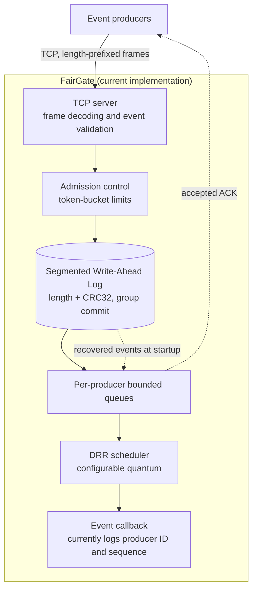

Accepted events are appended to the WAL before they are enqueued and acknowledged to the client. The current scheduler callback logs the selected event's producer ID and sequence number. A pluggable event-processing interface and storage adapters are part of the planned modular architecture.

The server's goroutine and context structure, including the shutdown path, is described in [Server lifecycle and graceful shutdown](#server-lifecycle-and-graceful-shutdown).

### Planned extension

The shipper, store abstraction, and ClickHouse adapter are not yet part of the ingestion path. Dashed elements below are planned.

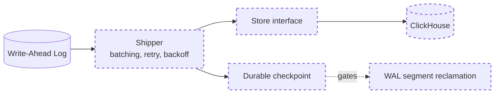

### Component responsibilities

| Package | Responsibility |
|---|---|
| `internal/server` | TCP listener, per-connection goroutines, connection tracking, frame handling, acknowledgment delivery, server lifecycle (`RunContext`), and graceful shutdown. |
| `internal/wire` | Frame codec, event and acknowledgment types, validation. |
| `internal/admit` | Token-bucket admission control. |
| `internal/sched` | Per-producer bounded queues (including context-aware `EnqueueContext`) and the DRR scheduler. |
| `internal/wal` | Segmented WAL, writer goroutine with group commit, segment rotation, synchronization, and ordered recovery. |

## Event lifecycle

The sequence below shows the path of a single event through the current implementation.

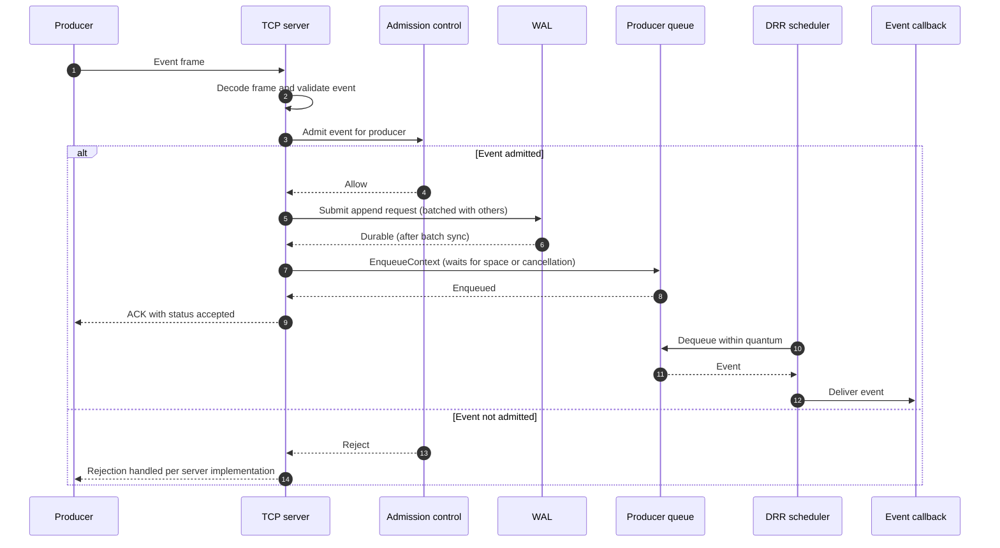

An `accepted` ACK reflects WAL durability and queue admission. It does not reflect downstream storage. See [Delivery semantics](#delivery-semantics).

If shutdown cancels the handler while it is waiting for queue space, the event has already been appended to the WAL but is not acknowledged. It remains available for recovery on the next startup.

## Event model

Events are represented as JSON with the following fields:

```json
{
  "producer_id": "sensor-01",
  "event_time": "2026-10-02T08:00:00Z",
  "seq": 1,
  "idx": 0,
  "event_type": "temperature",
  "payload": "{\"value\":24.7}"
}
```

| Field | Type | Description |
|---|---|---|
| `producer_id` | string | Identifier of the event producer |
| `event_time` | timestamp | Event timestamp |
| `seq` | unsigned integer | Producer sequence number |
| `idx` | unsigned integer | Event index |
| `event_type` | string | Event category |
| `payload` | string | Event payload |

The decoder requires a non-empty producer ID, a non-zero event time, and a non-empty event type.

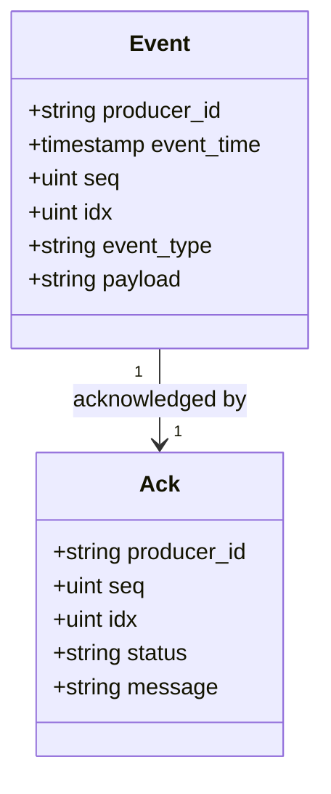

The `message` field of an acknowledgment is optional.

## Wire protocol

FairGate uses a length-prefixed frame format. Fields are transmitted in the order shown.

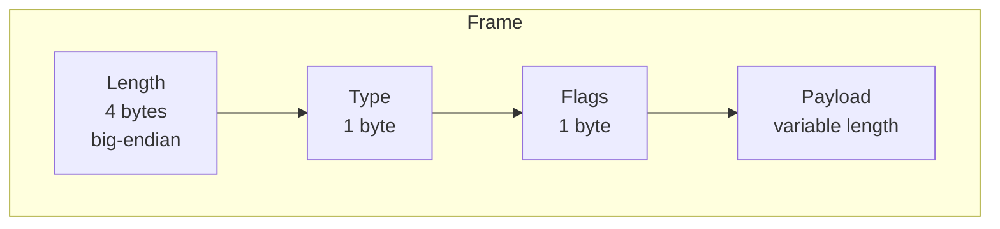

| Field | Size | Description |
|---|---|---|
| Length | 4 bytes, big-endian | Frame length prefix used to delimit frames on the TCP stream. |
| Type | 1 byte | Identifies the frame kind (see below). |
| Flags | 1 byte | Per-frame flags. |
| Payload | Variable | Frame body, interpreted according to the type. |

How frames are demultiplexed on a connection:

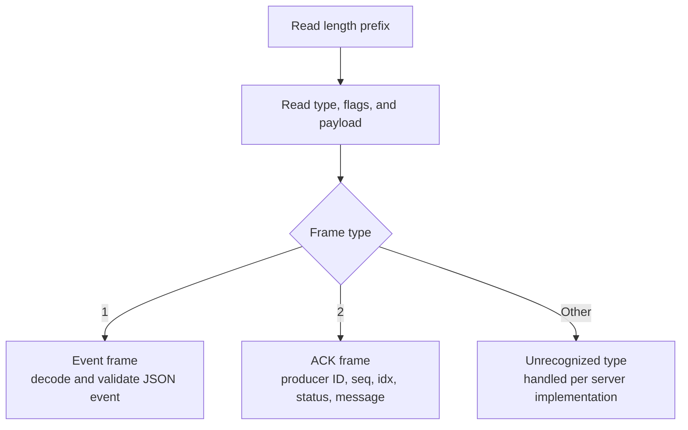

Event frames flow from producer to server and ACK frames flow from server to producer.

The current frame types are:

| Type | Purpose |
|---|---|
| `1` | Event |
| `2` | Acknowledgment (ACK) |

An ACK contains the producer ID, sequence number, event index, status, and an optional message. An `accepted` ACK indicates that the event was written to the WAL and enqueued. It does **not** indicate that a downstream database has stored or queried the event.

Refer to the `wire` package for the current protocol implementation and exact encoding behavior.

## Write-Ahead Log

The WAL stores serialized event records with a length field and a CRC32 checksum. The layout below is conceptual and is unchanged by segmentation and group commit. Refer to the `wal` package for the exact encoding.

```text
+----------------+----------------+---------------------------+
| Length         | CRC32          | Serialized event          |
+----------------+----------------+---------------------------+
```

### Segments

The log is stored as multiple segment files rather than one growing file. Each segment holds a sequence of records in the format above. The segment size is configurable. Before writing a record, the writer checks whether it would push the active segment past the limit, and if so rotates to a new segment first.

### Writer and group commit

A dedicated `writerLoop` goroutine owns all WAL file operations. Callers of `Append()` submit a request to a shared channel and wait for the result, rather than writing to disk themselves. The writer collects requests into a batch, bounded by a maximum request count and a short collection delay, writes the records, and performs one `Sync()` for the whole batch. Every caller in the batch is then released, so no `Append()` returns before its record has been synchronized.

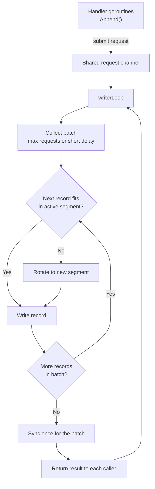

If a write, rotation, or sync fails, the error is recorded as fatal. Requests in the affected batch receive an error, and later batches are rejected instead of being reported as persisted.

Closing the WAL stops new submissions, lets queued requests finish, then synchronizes and closes the active segment before the writer exits.

### Recovery

On startup the WAL discovers its segments and scans them in order, record by record. An incomplete trailing record in the final segment is truncated to the last valid record boundary. Corrupt records and checksum mismatches in completed records are reported as errors.

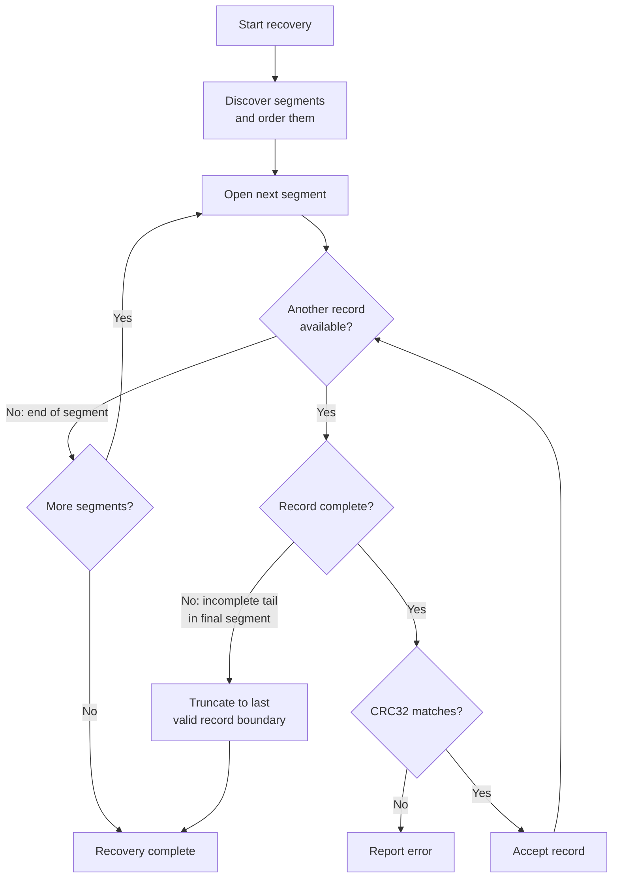

Recovered events are replayed into the producer queues. The scheduler is started before replay so that it consumes events while the queues fill, which avoids a startup deadlock when a producer has more recovered events than its queue capacity. Shipper checkpoints and automated segment reclamation are planned extensions, so completed segments are currently retained.

## Backpressure and scheduling

Each producer has its own bounded queue. The queue capacity is configured when the queue manager is created, and the server currently uses 256 events per producer. Enqueueing blocks when a producer's queue is full, applying backpressure to the caller instead of allowing the queue to grow without bound. In the connection handler the wait is context-aware (`EnqueueContext`), so a blocked handler can stop waiting if shutdown is forced.

The DRR scheduler visits producer queues and processes available events up to its configured quantum (currently 8 in the server). The scheduler is independent of event meaning, and its callback is responsible for downstream handling. At this beta stage, the callback only logs events.

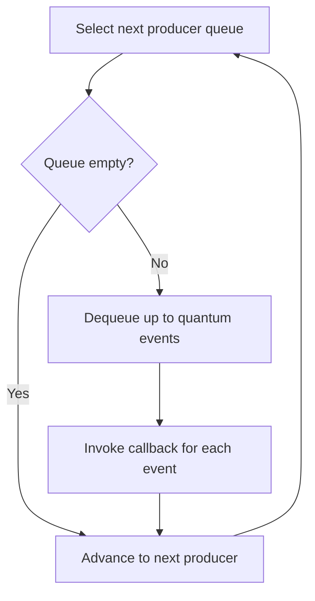

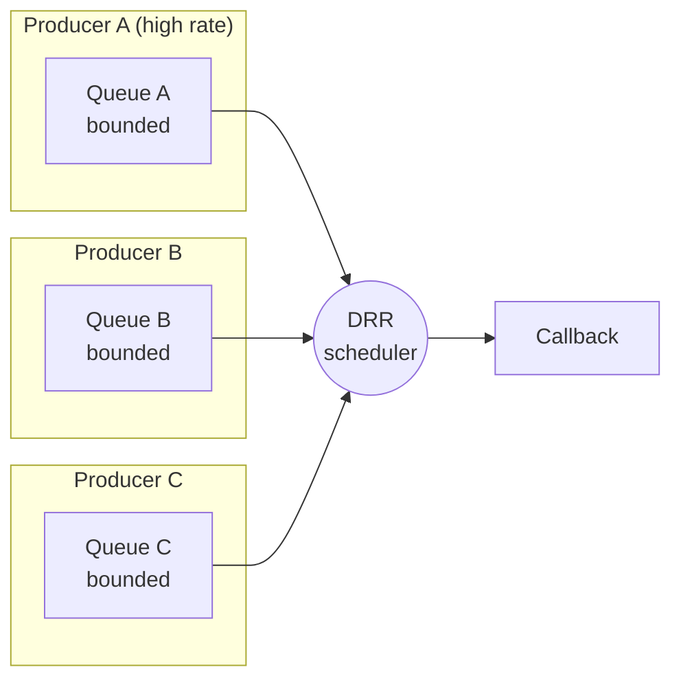

Because each queue is separate and bounded, a high-rate producer fills only its own queue. Other producers continue to be served in each scheduling round.

## Server lifecycle and graceful shutdown

`RunContext(ctx, addr, logger)` owns the server's lifetime. Cancelling `ctx` starts an orderly shutdown. `Run(addr, logger)` is retained as a wrapper that calls `RunContext` with `context.Background()`.

### Goroutines and contexts

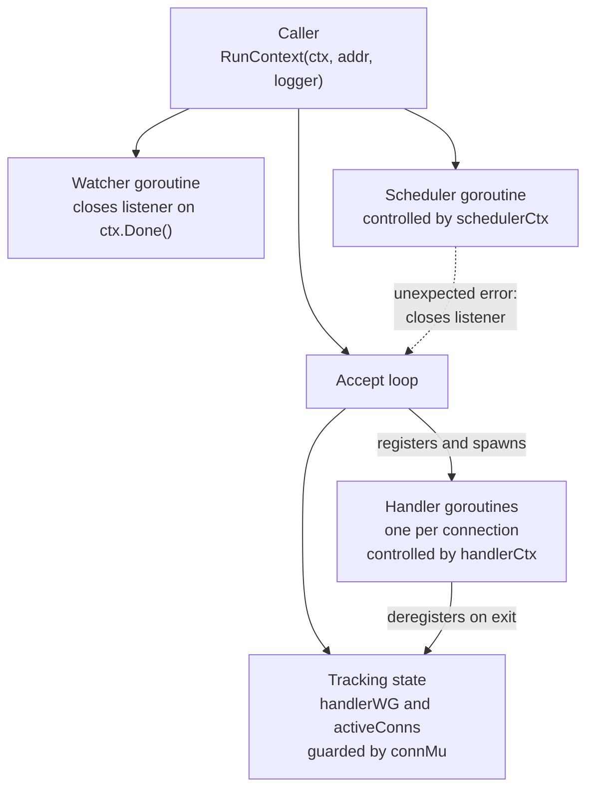

| Mechanism | Purpose |
|---|---|
| `handlerWG` | Counts active handler goroutines so the server can wait for them. |
| `activeConns` and `connMu` | Track live connections so they can be closed if handlers do not finish in time. |
| `handlerCtx` | Cancelled only when the grace period expires, to interrupt blocked enqueues. |
| `schedulerCtx` | Cancelled after handlers exit, so queued events keep being processed while handlers drain. |
| `schedulerDone` and `schedulerErr` | Signal scheduler exit and report unexpected scheduler failures without blocking. |
| Watcher and `watchStop` | Close the listener on cancellation, and let the watcher exit if the accept loop ends first. |

### Shutdown sequence

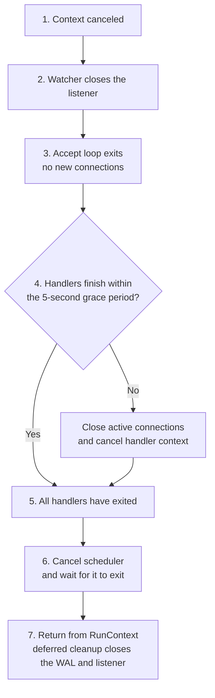

The ordering is deliberate. The WAL is closed only after every tracked handler has exited, so no handler can append to a closed log. Closing the WAL then drains queued append requests and synchronizes the active segment before the writer exits. The scheduler keeps running during the grace period so queued events continue to be processed while handlers drain.

### Behavior details

- **Closing a connection interrupts a blocked read.** Handlers waiting in `wire.ReadFrame()` exit once their connection is closed, instead of waiting indefinitely for the client.
- **Accept-loop errors are classified.** A closed listener or a canceled context is treated as normal shutdown. Any other listener error, or a scheduler failure, is returned to the caller.
- **Scheduler failure is fatal.** If the scheduler stops unexpectedly, the listener is closed and the error is returned from `RunContext`.
- **Select ordering.** If a queue send and context cancellation are ready at the same moment, Go's `select` may pick either. A handler may therefore enqueue one more event after cancellation.

### Embedding the server

From within the module, for example in a `cmd/` entry point:

```go
ctx, stop := signal.NotifyContext(context.Background(), os.Interrupt, syscall.SIGTERM)
defer stop()

if err := server.RunContext(ctx, ":9000", logger); err != nil {
    logger.Error("server stopped", "error", err)
}
```

### Limitations

- The five-second grace period bounds the wait before forced connection closure. It does not guarantee that shutdown completes within five seconds, because a handler blocked in an operation that responds to neither connection closure nor context cancellation could still delay it.
- There is no explicit queue-drain confirmation. The scheduler callback only logs events, so shutdown does not prove that every queued event was delivered downstream. Events appended to the WAL remain recoverable on the next startup.

## Delivery semantics

| Property | Current beta |
|---|---|
| Event persisted to the WAL before acknowledgment | Yes |
| Disk synchronization completed (per batch) before acknowledgment | Yes |
| Acknowledgment sent after enqueue | Yes |
| Per-producer memory bounded | Yes, by queue capacity |
| WAL split into segments with rotation | Yes |
| Persisted records scanned across segments on restart | Yes |
| Recovered events replayed into queues on restart | Yes |
| WAL write or sync failure surfaced to callers | Yes |
| WAL kept open until all handlers exit during shutdown | Yes |
| Explicit queue-drain confirmation on shutdown | No |
| Events shipped to a database | No (planned) |
| Acknowledgment implies database storage | No |
| End-to-end exactly-once delivery | No |

Do not treat the current beta as a production-ready, exactly-once event delivery system.

## Configuration

The following values are currently fixed in the server and are expected to become configurable.

| Setting | Current value | Description |
|---|---|---|
| Queue capacity | 256 events per producer | Bound on each producer's queue. |
| DRR quantum | 8 | Maximum events served from a producer queue per visit. |
| Shutdown grace period | 5 seconds | Time active handlers have to finish before connections are forcibly closed. |

The WAL segment size is configurable. Group commit batching is bounded by a maximum request count and a short collection delay; refer to the `wal` package for the current options and defaults.

## Planned storage integration

ClickHouse is the intended initial storage backend. The project plan includes a `Store` abstraction and a ClickHouse adapter, with an asynchronous shipper that reads from the WAL, batches records, retries failed inserts, and persists checkpoints.

> [!NOTE]
> **The current beta does not yet ship WAL events to ClickHouse automatically.** Having a ClickHouse database or table available does not by itself connect it to the current event path.

### Intended shipper ordering

The intended design decouples producer acknowledgments from database availability: producers are acknowledged on WAL durability, and the shipper delivers to the database asynchronously. The checkpoint is written only after a batch insert succeeds.

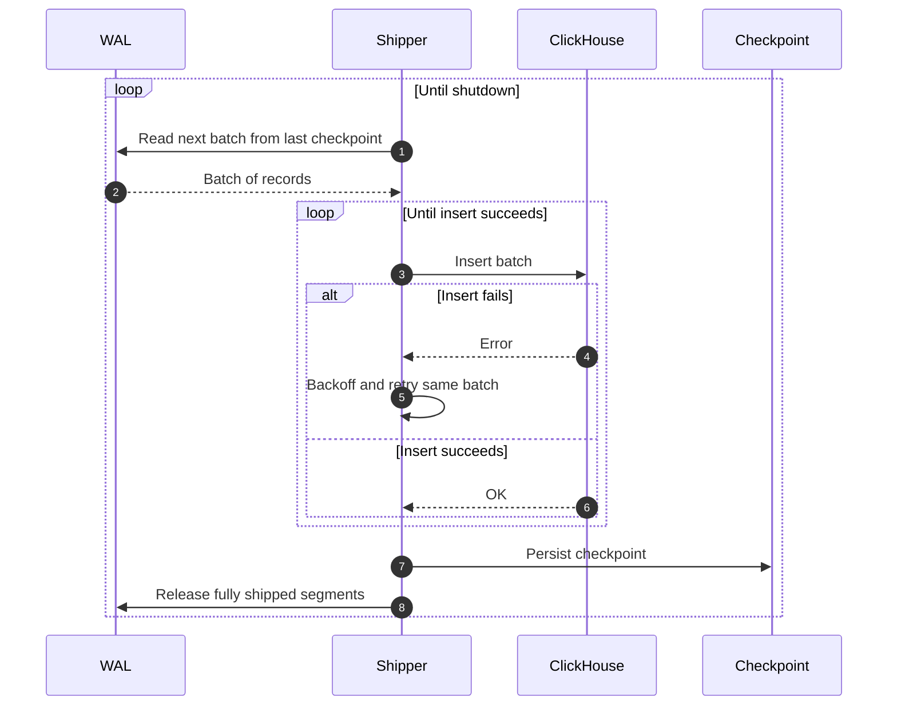

### Duplicate handling

A crash between a successful insert and the checkpoint write would cause the same batch to be inserted again after restart. The planned design addresses this with an idempotent table definition keyed on a unique event identity, so repeated inserts converge to a single row. Exact-count queries would need to account for merge timing until deduplication completes. Batch delivery, retry behavior, checkpoint ordering, and duplicate handling must be implemented and validated before database delivery guarantees are documented.

### Target schema (planned)

The existing `fairgate.events` schema can be maintained as the target schema for the adapter. The definition below is illustrative of the intended direction and may change.

```sql
CREATE TABLE IF NOT EXISTS fairgate.events (
    producer_id  LowCardinality(String),
    seq          UInt64,
    idx          UInt32,
    event_time   DateTime64(3, 'UTC'),
    ingest_time  DateTime64(3, 'UTC'),
    event_type   LowCardinality(String),
    payload      String CODEC(ZSTD(3)),
    wal_segment  UInt64,
    wal_offset   UInt64
) ENGINE = ReplacingMergeTree
PARTITION BY toDate(ingest_time)
ORDER BY (producer_id, event_time, seq, idx);
```

## Roadmap

The roadmap lists planned work in dependency order. Items are subject to change.

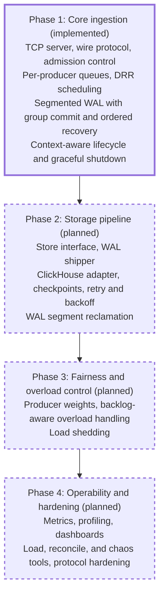

A solid border marks implemented work. Dashed borders mark planned work.

| Area | Status |
|---|---|
| Ingestion, validation, admission control | Implemented |
| Per-producer queues, DRR scheduling | Implemented |
| WAL append and recovery | Implemented |
| WAL segmentation and group commit | Implemented |
| Context-aware lifecycle, connection tracking, graceful shutdown | Implemented |
| Cancelable enqueueing and scheduler error propagation | Implemented |
| Shipper, store abstraction, ClickHouse adapter | Planned |
| Checkpoints, retry, backoff | Planned |
| WAL segment reclamation | Planned |
| Producer weights and richer fairness controls | Planned |
| Backlog-aware overload handling | Planned |
| Metrics, profiling, dashboards | Planned |
| Load generator, reconciliation, chaos tooling | Planned |
| Explicit queue-drain confirmation on shutdown | Planned |
| Protocol hardening | Planned |

## Project structure

```text
FairGate/
├── internal/
│   ├── admit/       # Admission control
│   ├── sched/       # Producer queues and DRR scheduler
│   ├── server/      # TCP listener and connection handling
│   ├── wal/         # Segmented WAL, group commit, and recovery
│   └── wire/        # Frame codec, event and ACK types
├── data/            # Local WAL data (runtime; do not commit)
├── go.mod
└── README.md
```

This reflects the current core packages. Additional packages and commands may be added as development continues.

## Getting started

### Requirements

- Go toolchain compatible with the version declared in `go.mod`
- Git

### Installation

```bash
git clone https://github.com/PratyushVishal11011/Fairgate.git
cd Fairgate
go mod download
```

### Build and test

```bash
# Build all packages
go build ./...

# Run the test suite
go test ./...

# Run tests with the race detector
go test -race ./...
```

The repository is being developed as a gateway implementation. A stable command-line interface and client SDK are planned. Check the repository's current entry point and configuration before attempting to launch a server.

## Development status and limitations

FairGate is an experimental beta. Interfaces, protocol details, configuration, and storage semantics may change. The project has tests for implemented components, but its end-to-end durability and fairness goals still require broader load, crash-recovery, and downstream-outage validation.

Known limitations of the current beta:

- Events are not delivered to any database. The scheduler callback only logs events.
- The WAL is segmented with group commit, but completed segments are not reclaimed automatically; reclamation depends on the planned shipper checkpoints.
- Queue capacity, DRR quantum, and the shutdown grace period are fixed in the server and not yet configurable.
- All producers receive equal scheduling treatment. Weights are not yet supported.
- Enqueueing blocks on a full queue (cancelable during shutdown), and no load-shedding policy exists yet.
- A WAL write, rotation, or sync failure is fatal: later appends are rejected until the WAL is reopened.
- Shutdown has no explicit queue-drain confirmation, and a handler stuck in an operation that ignores connection closure and context cancellation can delay it beyond the grace period.
- No metrics, profiling endpoints, or dashboards are provided.

## Contributing

Issues, bug reports, design discussions, and pull requests are welcome. For substantial changes, open an issue first to discuss the proposed behavior or interface.

When contributing:

1. Keep core ingestion and scheduling independent of business-specific logic.
2. Prefer bounded memory and explicit backpressure.
3. Add tests for new behavior and failure paths.
4. Run `go test ./...` and `go test -race ./...` before submitting a pull request.

## License

FairGate is released under the [MIT License](LICENSE).