# FairGate

**A fair-share event ingestion gateway written in Go.**

FairGate is a modular event-ingestion gateway. It accepts framed event streams over TCP, applies admission control, persists accepted events in a segmented Write-Ahead Log (WAL) with group commit, schedules events from per-producer queues using Deficit Round Robin (DRR), and ships durable WAL records to ClickHouse through a checkpointed shipper that also reclaims fully shipped WAL segments.

The project explores fair resource sharing in event-ingestion systems: keeping producers isolated from one another through bounded buffering, admission limits, and fair scheduling. FairGate is being developed as an open-source foundation that can be extended with different storage backends and downstream processing components.

> [!IMPORTANT]
> **Beta status.** FairGate is under active development. The current implementation provides TCP ingestion, event decoding and validation, admission control, per-producer bounded queues, DRR scheduling, a segmented WAL with group commit and ordered recovery, acknowledgments, and context-aware graceful shutdown. The gateway always runs a shipper that reads durable WAL records from a persisted checkpoint, batches them for a `Store` (ClickHouse), retries failed inserts with capped exponential backoff and jitter, atomically persists progress after successful inserts, and then reclaims WAL segments older than the checkpoint segment. The gateway serves an HTTP health endpoint and Prometheus metrics, and a Docker Compose stack runs FairGate with ClickHouse, Prometheus, and Grafana. Delivery to the database is at-least-once, not exactly-once, and advanced overload control, profiling, and deep pipeline observability are not implemented.

## Table of Contents

- [Design goals](#design-goals)
- [Features](#features)
- [Recent updates](#recent-updates)
- [Architecture](#architecture)
- [Event lifecycle](#event-lifecycle)
- [Event model](#event-model)
- [Wire protocol](#wire-protocol)
- [Write-Ahead Log](#write-ahead-log)
- [Backpressure and scheduling](#backpressure-and-scheduling)
- [Server lifecycle and graceful shutdown](#server-lifecycle-and-graceful-shutdown)
- [Delivery semantics](#delivery-semantics)
- [Configuration](#configuration)
- [Storage integration](#storage-integration)
- [Roadmap](#roadmap)
- [Project structure](#project-structure)
- [Getting started](#getting-started)
- [Docker deployment](#docker-deployment)
- [Development status and limitations](#development-status-and-limitations)
- [Contributing](#contributing)
- [License](#license)

## Design goals

| Goal | Approach |
|---|---|
| Producer isolation | Each producer has its own bounded queue, so one producer cannot consume another producer's buffer space. |
| Fair service | DRR scheduling visits producer queues in rounds and serves a bounded amount from each. |
| Bounded resource usage | Every queue has an explicit capacity, and a full queue applies backpressure instead of growing. Shipped WAL segments are reclaimed instead of accumulating. |
| Durability before acknowledgment | Events are appended to the WAL and synchronized to disk (via group commit) before an acknowledgment is sent. |
| Extensibility | Core ingestion and scheduling are independent of event meaning. Storage and processing attach through well-defined seams. |

## Features

### Currently implemented

- **TCP event ingestion.** Accepts client connections and reads length-prefixed frames.
- **Framed wire protocol.** Identifies event and acknowledgment frames using frame types.
- **JSON event decoding.** Decodes events and checks required fields.
- **Admission control.** Applies token-bucket-based limits to incoming events (currently 500 requests per second with a burst of 1,000).
- **Per-producer queues.** Keeps producer events in separate bounded channels (512 events each).
- **DRR scheduling.** Selects queued events in producer rounds using a configurable quantum.
- **Segmented Write-Ahead Log.** Appends events with length and CRC metadata across multiple segment files, rotating to a new segment when the configured segment size would be exceeded.
- **Group commit.** A dedicated writer goroutine batches concurrent append requests and issues a single `Sync()` per batch, bounded by a maximum request count and a short collection delay.
- **WAL recovery.** Lists the segment files that exist, sorts them by ID, scans them in order on startup, truncates an incomplete trailing record in the final segment only, rejects incomplete records in earlier segments, tolerates a sparse segment set, and replays recovered events into the producer queues.
- **WAL fatal error handling.** Write, rotation, and synchronization failures are recorded as fatal; affected requests receive an error and later batches are rejected.
- **Durable WAL reader.** Reads records only up to the WAL's synchronized durable end, verifies length, CRC32, and JSON, returns each event with its start and end positions, and advances across segment boundaries (to the next segment that exists) from any saved position.
- **WAL-backed batch shipper.** `Shipper.Run(ctx)` loads the checkpoint, reads durable records in order up to `BatchSize`, and sends each batch to the configured `Store`. At the durable WAL end it polls for new records and keeps running until its context is canceled.
- **Always-on gateway shipper.** `RunContext` always constructs the ClickHouse store and starts the shipper alongside the server. Shutdown always cancels and joins it before the store and WAL are closed.
- **Retry with backoff.** Retries failed batch inserts with capped exponential delay, configurable jitter, and context-aware waiting. The same batch is retried until it succeeds or the context is canceled.
- **Durable checkpoints.** Stores the last successfully inserted record position as a segment and offset. Checkpoints are written through a synced temporary file followed by an atomic rename; a missing checkpoint starts reading at the beginning of the WAL, and invalid JSON or negative offsets are rejected.
- **Checkpoint-based WAL reclamation.** After each committed checkpoint, and once at startup against the checkpoint already on disk, the shipper calls `WAL.ReclaimBefore`. Only segments with IDs strictly less than the checkpoint segment are deleted; the checkpoint segment and the active segment are retained. Reclamation is serialized with rotation, and the containing directory is synced after deletion.
- **Store interface.** `InsertBatch(ctx, events)` and `Close()` separate storage from the processing pipeline.
- **ClickHouse adapter.** Official Go client with configurable authentication, `Ping` health checks, batched inserts through `PrepareBatch` and `Send`, and graceful cleanup.
- **Optional ClickHouse integration test.** Environment-gated test covering connectivity, batch insertion, and retrieval.
- **Health and Prometheus endpoints.** FairGate responds with `200 OK` and `ok` at `/health` on port `9100`; Docker Compose uses this endpoint for its gateway healthcheck. Prometheus metrics for active TCP connections, accepted, rejected and invalid events, WAL append errors, and scheduler processing totals remain available at `/metrics` on port `9100`.
- **Docker deployment.** A `Dockerfile` and Compose stack run FairGate with ClickHouse, Prometheus, and Grafana. Prometheus scrapes the gateway and Grafana provisions its Prometheus datasource and FairGate overview dashboard. `install-docker-ubuntu.sh` installs Docker Engine and the Compose plugin on Ubuntu.
- **Acknowledgments.** Sends an accepted acknowledgment after the event has been appended to the WAL and enqueued.
- **Concurrent connections.** Handles client connections in separate goroutines and tracks them for coordinated shutdown.
- **Context-aware lifecycle.** `RunContext` lets the caller control server lifetime through a `context.Context`.
- **Graceful shutdown.** Stops accepting clients, waits for active handlers within a grace period, forces closure of blocked connections afterward, stops the scheduler and shipper, and then closes the store and WAL.
- **Cancelable enqueueing.** A handler blocked on a full producer queue can be interrupted during shutdown.
- **Scheduler error propagation.** An unexpected scheduler failure is reported to the caller instead of being silently lost.
- **Tests.** Includes unit and integration tests for core behavior. Graceful-shutdown tests use a no-op `Store` and a temporary checkpoint path, so they do not need a live ClickHouse service.

### Planned

- Configurable producer weights and richer fairness controls
- Backlog-aware overload handling and load shedding
- Profiling endpoints, deeper pipeline metrics, alerting, and deeper operational dashboards
- Packaged load-generation, reconciliation, and chaos-testing tools
- Additional protocol hardening
- Explicit queue-drain confirmation during shutdown

Planned capabilities are not implied to be available in this beta.

## Recent updates

### 09th October, 2026: Gateway health, metrics, and deployment monitoring

The gateway now exposes an HTTP health endpoint and Prometheus metrics alongside its TCP ingestion listener. The Compose deployment publishes the gateway's TCP and HTTP ports, checks gateway health, and provisions Prometheus and Grafana for monitoring.

- **Health endpoint.** `GET /health` on port `9100` returns `200 OK` with `ok`. Docker Compose uses it to report whether the FairGate container is healthy.
- **Prometheus metrics.** `GET /metrics` on port `9100` reports active TCP connections, accepted, rejected and invalid events, WAL append errors, and scheduler processing totals. Prometheus is configured to scrape the gateway every five seconds.
- **Grafana monitoring.** Compose provisions Prometheus as Grafana's data source and loads the FairGate Overview dashboard, including active connections, event rate, and WAL append errors.
- **Container image versions.** Prometheus and Grafana now use pinned image versions rather than `latest`.
- **Gateway capacity settings.** The configured shipper batch size is 200, admission control is set to 500 requests per second with a 1,000 request burst, and per-producer queues buffer up to 512 events.
- **Published service ports.** Compose publishes FairGate TCP port `9001`, its HTTP port `9100`, ClickHouse port `9000`, Prometheus port `9090`, and Grafana on host port `3001`.
- **Stress tests.** Ran multiple stress tests with varying producer counts and workload types, including bursty and misbehaving-producer workloads. A report is coming soon.

See [Docker deployment](#docker-deployment) for the Compose setup and monitoring URLs.

### 06th October, 2026: Checkpoint-based WAL reclamation and always-on shipper

Earlier versions kept every completed WAL segment on disk and started the shipper only when `FAIRGATE_SHIPPER_ENABLED=true`. The latest changes let the WAL reclaim segments the shipper has already delivered, and make shipping part of every gateway run.

- **Checkpoint-driven reclamation.** After each successful `Store.InsertBatch`, the shipper atomically commits the batch's end position and then calls `WAL.ReclaimBefore` with that position. At startup it also reclaims against the checkpoint already on disk.
- **Conservative deletion rule.** Reclamation deletes only segments whose IDs are strictly less than the checkpoint segment. The checkpoint segment is retained because its offset may still leave records to ship, and the active segment is always retained.
- **Rotation-safe deletion.** The WAL serializes reclamation with rotation using a segment mutex, and syncs the containing directory after deletion.
- **Sparse segment sets.** Segment discovery lists only files that exist and sorts them by ID. Recovery handles a sparse segment set, and the reader advances to the next extant segment instead of assuming contiguous IDs.
- **Shipper always on.** The gateway no longer reads or validates `FAIRGATE_SHIPPER_ENABLED`. `RunContext` always constructs the ClickHouse store and starts the shipper, and shutdown always cancels and joins it before storage and WAL cleanup. The redundant setting was removed from Docker Compose, and this README describes shipping as always enabled. Existing deployments can drop the variable; it has no effect.
- **Test seam.** Startup logic was split so the public entry point supplies the ClickHouse store while tests can supply a no-op `Store`. Graceful-shutdown tests also use a temporary checkpoint path, so they no longer depend on a live ClickHouse service.

Reclamation depends on the shipper. If ClickHouse is unavailable, the checkpoint does not advance and segments accumulate until delivery resumes. A crash after a successful insert but before the checkpoint commit can still replay that batch, so delivery remains at-least-once rather than exactly-once.

See [Write-Ahead Log](#write-ahead-log) for the reclamation rules and [Storage integration](#storage-integration) for the shipper flow.

### 05th October, 2026: Gateway shipper runtime and Docker deployment

The gateway could now start the WAL shipper as part of `RunContext` when `FAIRGATE_SHIPPER_ENABLED=true`. The shipper polls the durable WAL end for new records, retries ClickHouse insert failures, and persists its checkpoint after successful batches. Docker Compose passes the ClickHouse connection settings and waits for ClickHouse health before starting FairGate. The `install-docker-ubuntu.sh` script installs Docker Engine and the Compose plugin on Ubuntu.

The opt-in setting was removed in the 06th October update; the shipper now always runs.

For remote access, publish TCP port `9001` on a non-loopback interface and allow inbound TCP `9001` through the host firewall.

See [Docker deployment](#docker-deployment) and [Storage integration](#storage-integration).

### 05th October, 2026: WAL shipping, durable checkpoints, and retry backoff

The latest changes connect the storage building blocks to a WAL-reading shipper. They add record-position tracking across segments, persistent progress, and retry handling for failed storage writes.

- **Durable WAL reader.** Reads only records up to the WAL's synchronized durable end, verifies record length, CRC32, and JSON, and returns each event with its start and end positions. It advances across segment boundaries and can start from a saved position.
- **Checkpoint-based resume.** The checkpoint records a segment ID and byte offset. A missing checkpoint starts at the beginning of the WAL; invalid JSON and negative offsets are rejected.
- **Atomic checkpoint commit.** Each successful batch advances the checkpoint by writing and syncing a temporary JSON file, then renaming it over the checkpoint path.
- **WAL-backed batch shipping.** `Shipper.Run(ctx)` loads the checkpoint, reads events in WAL order up to `BatchSize`, calls `Store.InsertBatch`, and commits the batch end position only after insertion succeeds. It returns when it reaches the current durable WAL end.
- **Retry and backoff.** Failed inserts retry the same batch using exponential delays capped at a maximum delay, with optional symmetric jitter. Waiting respects context cancellation; retries otherwise continue until success.
- **Cross-segment recovery validation.** Recovery now rejects incomplete records in non-final segments instead of truncating them; only an incomplete tail in the final segment can be truncated.
- **Storage interface export.** `Store.InsertBatch` is exported so the shipper can call storage implementations across package boundaries.

At this stage the shipper was a standalone component: it was not started by the gateway command, `Run` returned at the current durable end instead of following later appends, and there was no automatic WAL segment reclamation. Gateway wiring and polling were added in the next update, and checkpoint-based reclamation in the 06th October update. A crash after a successful insert but before the checkpoint commit can replay that batch, so these changes do not provide exactly-once delivery.

See [Storage integration](#storage-integration) for the shipper flow and [Write-Ahead Log](#write-ahead-log) for recovery behavior.

### 03rd October, 2026: Asynchronous shipper, Store interface, and ClickHouse adapter

Earlier versions stopped at the scheduler, whose callback only logged events, and had no way to hand events to a database. The latest changes add an asynchronous shipping layer and a storage abstraction, with ClickHouse as the first backend, so event scheduling is decoupled from database insertion.

- **Asynchronous shipper.** A bounded in-memory channel buffers incoming events, so callers are not blocked on database inserts. `BatchSize`, `FlushInterval`, and `QueueSize` control batch formation, flushing frequency, and buffer capacity.
- **Context-aware submission.** `Submit(ctx, event)` hands an event to the shipper and respects cancellation, so a caller waiting on a full buffer can stop waiting.
- **`Store` interface.** Storage operations are separated from the event processing pipeline behind `InsertBatch(ctx, events)` and `Close()`. Different backends can be implemented without modifying the shipper.
- **ClickHouse adapter.** Built on the official Go client, with connection initialization, configurable authentication, connection health checks through `Ping`, and graceful connection cleanup.
- **Batched insertion.** The adapter uses `PrepareBatch` and `Send` to reduce per-event insertion overhead.
- **`fairgate.events` persistence.** Events are stored with their producer ID, event timestamp, sequence number, index, event type, and payload. The adapter follows the existing ClickHouse schema, including `ReplacingMergeTree`, monthly partitioning, and a 30-day TTL.
- **Optional integration test.** An environment-gated ClickHouse test validates connectivity, batch insertion, and retrieval of persisted events. It does not run unless ClickHouse is configured.

These changes provide the shipping and storage building blocks. At that point, durable checkpoints, retry and backoff, and WAL segment reclamation were still separate upcoming steps, so database delivery guarantees were not yet documented. They were added in the updates above. See [Storage integration](#storage-integration).

### 03rd October, 2026: Segmented WAL and group commit

Earlier versions of the WAL stored all events in a single file and performed a disk synchronization (`Sync()`) for every appended event. The latest changes introduce WAL segmentation and group commit to manage log growth and reduce the overhead of frequent disk synchronization.

- **Segmented WAL.** The WAL is now split into multiple files, with a configurable segment size. When the active segment reaches its size limit, the writer rotates to a new segment instead of continuing to grow a single file.
- **Ordered recovery.** Recovery discovers WAL segments and processes them in order, reconstructing events across multiple files while preserving the existing record format.
- **Incomplete record handling.** Recovery can truncate an incomplete trailing record in the final segment to the last valid record boundary, while treating corruption in completed records as an error.
- **Dedicated writer goroutine.** A separate `writerLoop` now owns WAL file operations. Instead of each `Append()` call writing directly to disk, requests are submitted to a shared channel and processed by the writer.
- **Group commit.** Multiple append requests are collected into batches, allowing the WAL to perform a single `Sync()` for the batch rather than synchronizing after every event.
- **Bounded batching.** Batches are limited by a maximum request count and a short collection delay, allowing the writer to balance synchronization overhead with append latency.
- **Asynchronous request submission.** Concurrent handlers can submit append requests to the writer goroutine, while each caller waits for confirmation that its batch has been written and synchronized.
- **Segment rotation during batching.** The writer checks each record's size before writing and rotates the active segment when the next record would exceed the configured segment limit.
- **Fatal error handling.** Write, rotation, and synchronization failures are recorded as fatal WAL errors. Affected requests receive an error, and subsequent batches are rejected rather than being reported as successfully persisted.
- **Graceful WAL closure.** Closing the WAL stops new submissions, allows queued requests to be processed, and then synchronizes and closes the active segment before the writer exits.

These changes establish a WAL that supports multiple segments and batched disk synchronization while retaining the existing record framing and recovery format. Queue-drain confirmation during server shutdown and ClickHouse persistence were still separate upcoming steps at that point.

See [Write-Ahead Log](#write-ahead-log) for the writer flow and recovery behavior.

### 03rd October, 2026: Graceful shutdown and context-aware event handling

Earlier versions accepted connections and processed events concurrently, but had no coordinated way to stop accepting clients, let in-flight handlers finish, and release resources safely. The latest changes add a controlled shutdown sequence built on `context`, `sync.WaitGroup`, `sync.Mutex`, and channels.

- **`RunContext`.** A new context-aware entry point gives the caller control over server lifetime. `Run` remains as a thin wrapper that uses a background context, so existing callers are unaffected.
- **Connection tracking.** Active connections are registered in a mutex-protected map and counted with a `WaitGroup`, so the server knows which handlers are running and can wait for them.
- **Listener watcher.** A watcher goroutine closes the TCP listener when the context is canceled, which unblocks `Accept` and begins shutdown. It exits cleanly if the accept loop ends first.
- **Cancelable enqueueing.** `EnqueueContext` replaces the blocking enqueue in the connection handler, so a handler stuck on a full queue can stop waiting when shutdown is forced.
- **Separate handler and scheduler contexts.** Handlers can be canceled independently, which lets the scheduler keep processing queued events while handlers drain.
- **Scheduler lifecycle.** The server waits for the scheduler goroutine to exit before returning, and an unexpected scheduler failure closes the listener and is returned to the caller.
- **Five-second grace period.** After the accept loop stops, handlers get a fixed grace period. If it expires, active connections are closed and the handler context is canceled to interrupt blocked reads and enqueues.
- **WAL safety.** The WAL is not closed until every tracked handler has exited, so a handler cannot append to a closed log.

See [Server lifecycle and graceful shutdown](#server-lifecycle-and-graceful-shutdown) for diagrams, behavior details, and limitations.

## Architecture

### Current implementation

The diagram below shows the ingestion and WAL shipping paths in the gateway runtime.

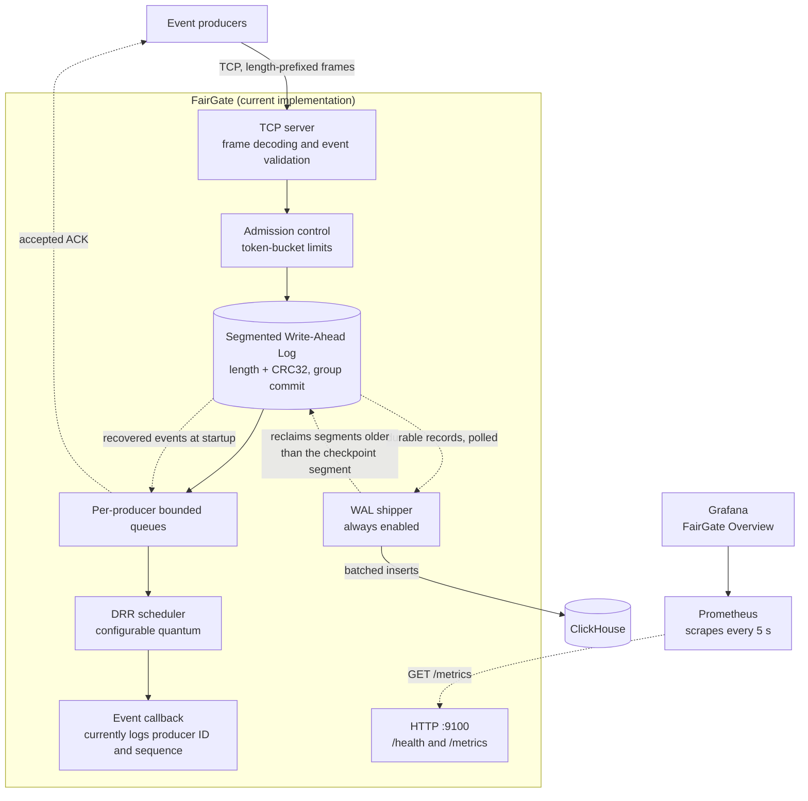

Accepted events are appended to the WAL before they are enqueued and acknowledged to the client. The scheduler callback logs selected events. The server always runs a WAL shipper that writes batches to ClickHouse independently of the scheduler and reclaims WAL segments once they are fully shipped. Alongside the TCP listener, the gateway serves `/health` and Prometheus `/metrics` on port `9100`; in the Compose stack Prometheus scrapes it and Grafana visualizes the result.

The server's goroutine and context structure, including the shutdown path, is described in [Server lifecycle and graceful shutdown](#server-lifecycle-and-graceful-shutdown).

### WAL shipping component

The shipper is always enabled and does not depend on `FAIRGATE_SHIPPER_ENABLED`. It reads durable WAL records from its checkpoint, inserts each batch through the `Store` interface, and commits the checkpoint only after insertion succeeds. It then calls `WAL.ReclaimBefore` with the committed position, which deletes segments older than the checkpoint segment. At the WAL end it polls for new durable records.

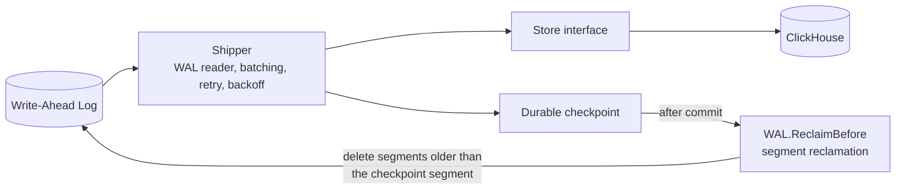

### Component responsibilities

| Package | Responsibility |
|---|---|
| `internal/server` | TCP listener, per-connection goroutines, connection tracking, frame handling, acknowledgment delivery, server lifecycle (`RunContext`), required shipper startup and shutdown, graceful shutdown, and the HTTP health and Prometheus metrics endpoint. |
| `internal/wire` | Frame codec, event and acknowledgment types, validation. |
| `internal/admit` | Token-bucket admission control. |
| `internal/sched` | Per-producer bounded queues (including context-aware `EnqueueContext`) and the DRR scheduler. |
| `internal/wal` | Segmented WAL, writer goroutine with group commit, segment rotation, synchronization, ordered recovery with cross-segment validation over a possibly sparse segment set, and checkpoint-based segment reclamation (`ReclaimBefore`). |
| `internal/shipper` | Durable WAL reader, checkpoint load and atomic commit, batching, polling at the durable end, retry with capped exponential backoff and jitter, and triggering WAL reclamation after each commit and at startup. |
| `internal/store` | `Store` interface and the ClickHouse adapter. |

## Event lifecycle

The sequence below shows the path of a single event through the current implementation.

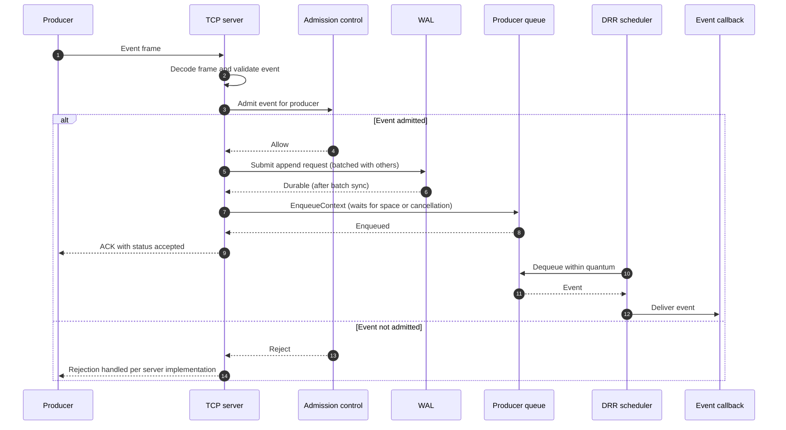

An `accepted` ACK reflects WAL durability and queue admission. It does not reflect downstream storage. See [Delivery semantics](#delivery-semantics).

If shutdown cancels the handler while it is waiting for queue space, the event has already been appended to the WAL but is not acknowledged. It remains available for recovery on the next startup, unless the shipper has already delivered it and reclaimed its segment.

The shipper picks the event up from the WAL separately, after the event is durable and independently of the scheduler. Once the shipper's checkpoint moves past the segment holding the event, that segment becomes eligible for reclamation.

## Event model

Events are represented as JSON with the following fields:

```json
{
  "producer_id": "sensor-01",
  "event_time": "2026-10-02T08:00:00Z",
  "seq": 1,
  "idx": 0,
  "event_type": "temperature",
  "payload": "{\"value\":24.7}"
}
```

| Field | Type | Description |
|---|---|---|
| `producer_id` | string | Identifier of the event producer |
| `event_time` | timestamp | Event timestamp |
| `seq` | unsigned integer | Producer sequence number |
| `idx` | unsigned integer | Event index |
| `event_type` | string | Event category |
| `payload` | string | Event payload |

The decoder requires a non-empty producer ID, a non-zero event time, and a non-empty event type.

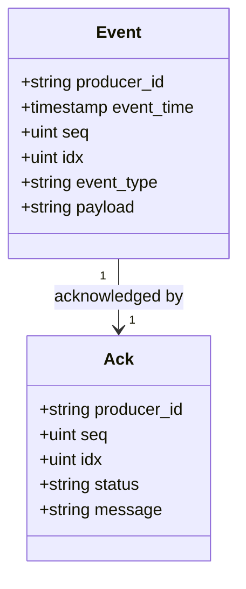

The `message` field of an acknowledgment is optional.

## Wire protocol

FairGate uses a length-prefixed frame format. Fields are transmitted in the order shown.

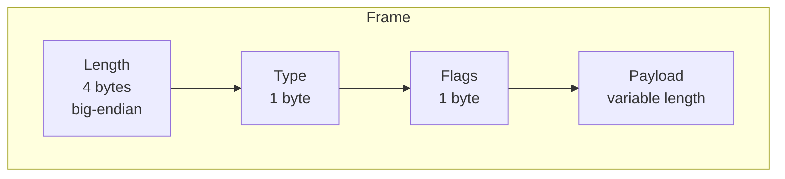

| Field | Size | Description |
|---|---|---|
| Length | 4 bytes, big-endian | Frame length prefix used to delimit frames on the TCP stream. |
| Type | 1 byte | Identifies the frame kind (see below). |
| Flags | 1 byte | Per-frame flags. |
| Payload | Variable | Frame body, interpreted according to the type. |

How frames are demultiplexed on a connection:

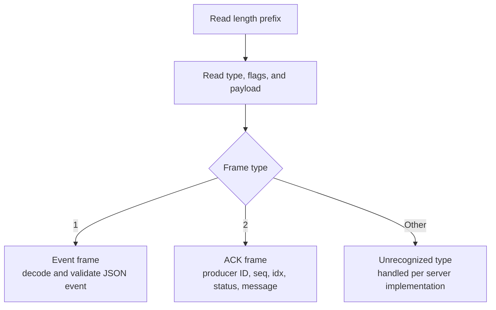

Event frames flow from producer to server and ACK frames flow from server to producer.

The current frame types are:

| Type | Purpose |
|---|---|
| `1` | Event |
| `2` | Acknowledgment (ACK) |

An ACK contains the producer ID, sequence number, event index, status, and an optional message. An `accepted` ACK indicates that the event was written to the WAL and enqueued. It does **not** indicate that a downstream database has stored or queried the event.

Refer to the `wire` package for the current protocol implementation and exact encoding behavior.

## Write-Ahead Log

The WAL stores serialized event records with a length field and a CRC32 checksum. The layout below is conceptual and is unchanged by segmentation, group commit, and reclamation. Refer to the `wal` package for the exact encoding.

```text
+----------------+----------------+---------------------------+
| Length         | CRC32          | Serialized event          |
+----------------+----------------+---------------------------+
```

### Segments

The log is stored as multiple segment files rather than one growing file. Each segment holds a sequence of records in the format above. The segment size is configurable. Before writing a record, the writer checks whether it would push the active segment past the limit, and if so rotates to a new segment first.

A position in the log is identified by a segment ID and a byte offset within that segment. The shipper uses these positions for its checkpoint.

Segment IDs increase as the writer rotates, but the set of segments on disk is not necessarily contiguous, because reclamation deletes old segments. Discovery therefore lists only the files that exist and sorts them by ID, and nothing in the WAL assumes that consecutive IDs are present.

### Writer and group commit

A dedicated `writerLoop` goroutine owns all WAL file operations. Callers of `Append()` submit a request to a shared channel and wait for the result, rather than writing to disk themselves. The writer collects requests into a batch, bounded by a maximum request count and a short collection delay, writes the records, and performs one `Sync()` for the whole batch. Every caller in the batch is then released, so no `Append()` returns before its record has been synchronized.

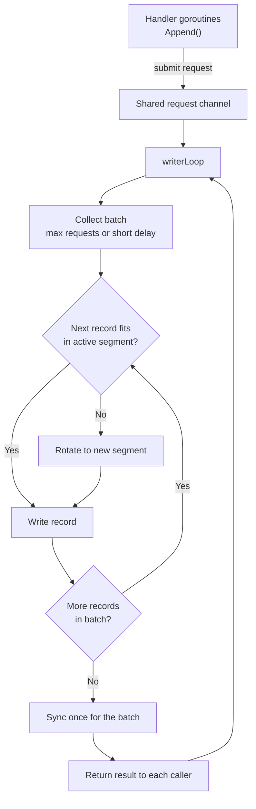

If a write, rotation, or sync fails, the error is recorded as fatal. Requests in the affected batch receive an error, and later batches are rejected instead of being reported as persisted.

Closing the WAL stops new submissions, lets queued requests finish, then synchronizes and closes the active segment before the writer exits.

### Segment reclamation

Once the shipper has committed a checkpoint, segments that lie entirely before it are no longer needed. After each successful `Store.InsertBatch`, the shipper atomically commits the batch's end position and then calls `WAL.ReclaimBefore` with that position. At startup it also reclaims against the checkpoint already on disk, so segments left over from an earlier run are removed as well.

The deletion rules are conservative:

- Only segments whose IDs are strictly less than the checkpoint segment are deleted.
- The checkpoint segment is retained, because the checkpoint offset may still leave records in it to ship.
- The active segment is always retained.
- Reclamation is serialized with rotation through a segment mutex, so a segment is not deleted while the writer is rotating.
- The containing directory is synced after deletion so the removals are durable.

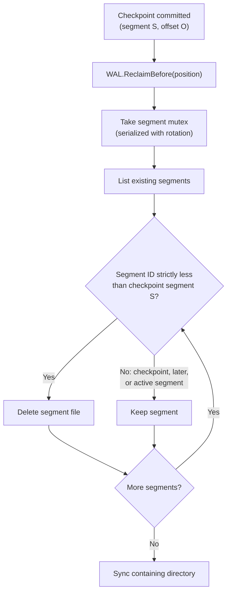

Because the checkpoint is committed before reclamation runs, a crash between the two can only leave extra segments behind. It cannot remove records that have not been shipped. Reclamation works on whole segments, so shipped records in the checkpoint segment stay on disk until a later checkpoint moves past it.

### Recovery

On startup the WAL lists the segment files that exist, sorts them by ID, and scans them in order, record by record. The final segment is the highest-numbered one on disk, and a sparse set left behind by reclamation is handled without error. An incomplete trailing record in the **final** segment is truncated to the last valid record boundary. An incomplete record in any earlier segment is rejected as an error rather than truncated, because a completed segment should never end mid-record. Corrupt records and checksum mismatches in completed records are also reported as errors.

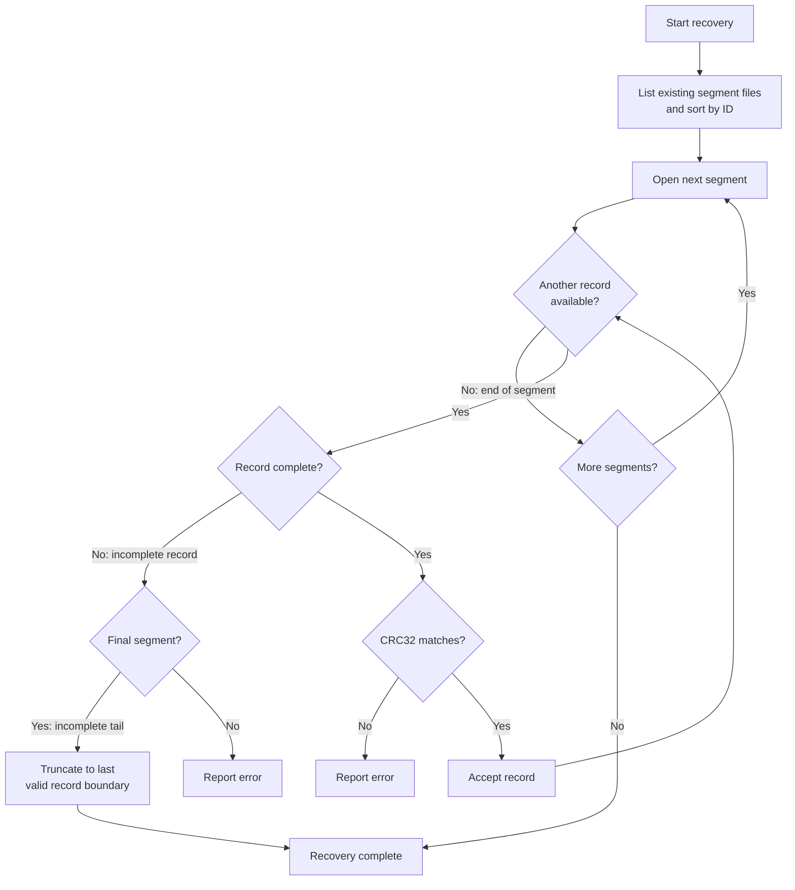

Recovered events are replayed into the producer queues. Replay covers only the segments still on disk, so records in reclaimed segments are not replayed. The scheduler is started before replay so that it consumes events while the queues fill, which avoids a startup deadlock when a producer has more recovered events than its queue capacity.

### Durable reader

The shipper reads the WAL through a reader that stops at the WAL's synchronized durable end, so it never returns a record that has not been synced. For each record it verifies the length, CRC32, and JSON, and returns the event together with its start and end positions. At the end of a segment it advances to the next segment that exists, rather than assuming IDs are contiguous, and it can begin at any saved position.

## Backpressure and scheduling

Each producer has its own bounded queue. The queue capacity is configured when the queue manager is created, and the server currently uses 512 events per producer. Enqueueing blocks when a producer's queue is full, applying backpressure to the caller instead of allowing the queue to grow without bound. In the connection handler the wait is context-aware (`EnqueueContext`), so a blocked handler can stop waiting if shutdown is forced.

The DRR scheduler visits producer queues and processes available events up to its configured quantum (currently 8 in the server). The scheduler is independent of event meaning, and its callback is responsible for downstream handling. At this beta stage, the callback only logs events; database delivery is handled by the separate WAL shipper.

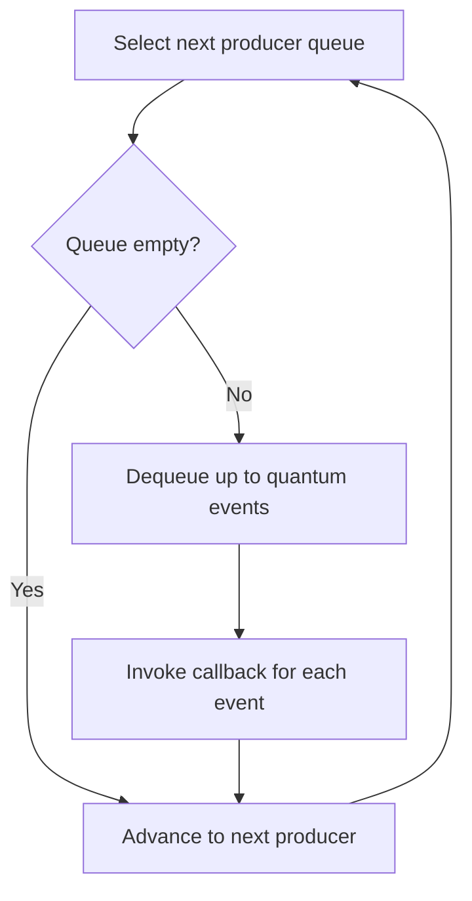

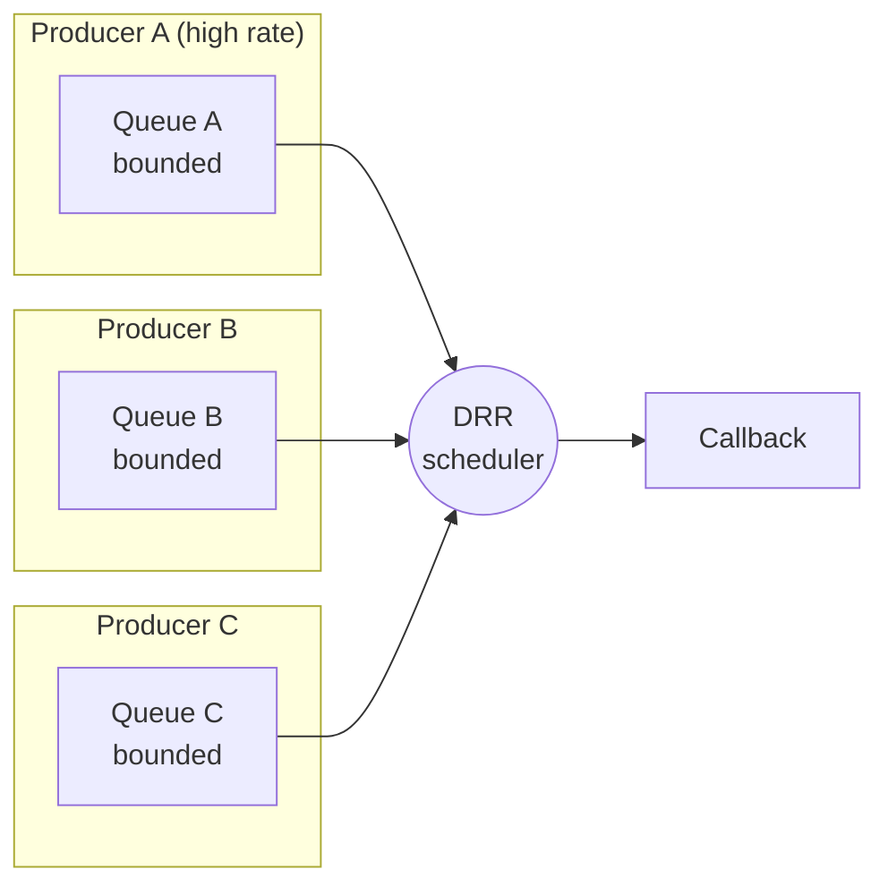

Because each queue is separate and bounded, a high-rate producer fills only its own queue. Other producers continue to be served in each scheduling round.

## Server lifecycle and graceful shutdown

`RunContext(ctx, addr, logger)` owns the server's lifetime. Cancelling `ctx` starts an orderly shutdown. `Run(addr, logger)` is retained as a wrapper that calls `RunContext` with `context.Background()`.

`RunContext` always constructs the ClickHouse store and starts the shipper. Startup is split so that the public entry point supplies the ClickHouse store to an inner startup path that accepts any `Store`; the graceful-shutdown tests use that path with a no-op `Store` and a temporary checkpoint path, so they do not need a live ClickHouse service.

### Goroutines and contexts

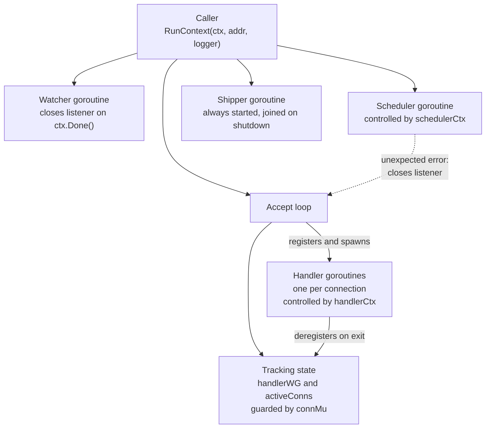

| Mechanism | Purpose |
|---|---|
| `handlerWG` | Counts active handler goroutines so the server can wait for them. |
| `activeConns` and `connMu` | Track live connections so they can be closed if handlers do not finish in time. |
| `handlerCtx` | Cancelled only when the grace period expires, to interrupt blocked enqueues. |
| `schedulerCtx` | Cancelled after handlers exit, so queued events keep being processed while handlers drain. |
| `schedulerDone` and `schedulerErr` | Signal scheduler exit and report unexpected scheduler failures without blocking. |
| Watcher and `watchStop` | Close the listener on cancellation, and let the watcher exit if the accept loop ends first. |

### Shutdown sequence

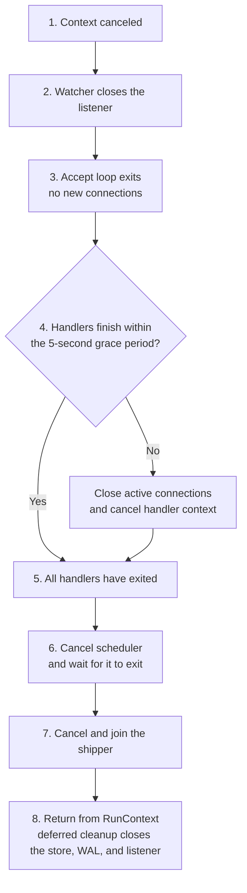

The ordering is deliberate. The WAL is closed only after every tracked handler has exited, so no handler can append to a closed log, and only after the shipper has stopped, so the shipper never reads from or reclaims in a closed log or writes to a closed store. Closing the WAL then drains queued append requests and synchronizes the active segment before the writer exits. The scheduler keeps running during the grace period so queued events continue to be processed while handlers drain.

### Behavior details

- **Closing a connection interrupts a blocked read.** Handlers waiting in `wire.ReadFrame()` exit once their connection is closed, instead of waiting indefinitely for the client.
- **Accept-loop errors are classified.** A closed listener or a canceled context is treated as normal shutdown. Any other listener error, or a scheduler failure, is returned to the caller.
- **Scheduler failure is fatal.** If the scheduler stops unexpectedly, the listener is closed and the error is returned from `RunContext`.
- **Select ordering.** If a queue send and context cancellation are ready at the same moment, Go's `select` may pick either. A handler may therefore enqueue one more event after cancellation.

### Embedding the server

From within the module, for example in a `cmd/` entry point:

```go
ctx, stop := signal.NotifyContext(context.Background(), os.Interrupt, syscall.SIGTERM)
defer stop()

if err := server.RunContext(ctx, ":9000", logger); err != nil {
    logger.Error("server stopped", "error", err)
}
```

The listen address is chosen by the caller. The ClickHouse store is built from the environment variables listed under [Configuration](#configuration), and the shipper always starts with it. The Docker Compose stack publishes port `9001`; see [Docker deployment](#docker-deployment).

### Limitations

- The five-second grace period bounds the wait before forced connection closure. It does not guarantee that shutdown completes within five seconds, because a handler blocked in an operation that responds to neither connection closure nor context cancellation could still delay it.
- There is no explicit queue-drain confirmation. The scheduler callback only logs events, so shutdown does not prove that every queued event was delivered downstream. Events appended to the WAL remain recoverable on the next startup.
- The server always stops and joins the shipper during shutdown before closing the store and WAL. Events not yet shipped at that point stay in the WAL and are picked up from the checkpoint on the next start.

## Delivery semantics

| Property | Current beta |
|---|---|
| Event persisted to the WAL before acknowledgment | Yes |
| Disk synchronization completed (per batch) before acknowledgment | Yes |
| Acknowledgment sent after enqueue | Yes |
| Per-producer memory bounded | Yes, by queue capacity |
| WAL split into segments with rotation | Yes |
| Persisted records scanned across segments on restart | Yes |
| Sparse segment set (after reclamation) handled on restart | Yes |
| Incomplete record in a non-final segment rejected on restart | Yes |
| Recovered events replayed into queues on restart | Yes, from segments still on disk |
| WAL write or sync failure surfaced to callers | Yes |
| WAL kept open until all handlers and the shipper exit during shutdown | Yes |
| Explicit queue-drain confirmation on shutdown | No |
| Shipper and ClickHouse adapter available | Yes |
| Shipper started by the gateway runtime | Yes; always enabled |
| Shipper stopped and joined before the store and WAL close | Yes |
| Shipper reads only synchronized (durable) WAL records | Yes |
| Shipper resumes from a durable WAL checkpoint after restart | Yes |
| Shipper follows new WAL appends continuously | Yes, by polling at the durable end |
| Checkpoint written atomically after a successful insert | Yes |
| Failed storage batches retried with backoff | Yes, until success or context cancellation |
| Batch may be inserted again after a crash before checkpoint commit | Yes (duplicates possible) |
| WAL segments reclaimed after shipping | Yes; segments older than the committed checkpoint segment are removed |
| Reclamation runs only after the checkpoint commit (and at startup against the checkpoint on disk) | Yes |
| Checkpoint segment or active segment reclaimed | No |
| Unshipped records removed by reclamation | No |
| WAL retains full event history | No |
| Acknowledgment implies database storage | No |
| End-to-end exactly-once delivery | No |

Do not treat the current beta as a production-ready, exactly-once event delivery system.

## Configuration

The following values are currently fixed in the server and are expected to become configurable.

| Setting | Current value | Description |
|---|---|---|
| Queue capacity | 512 events per producer | Bound on each producer's queue. |
| Admission rate / burst | 500 requests per second / 1,000 burst | Token-bucket limit applied by admission control. |
| DRR quantum | 8 | Maximum events served from a producer queue per visit. |
| Shutdown grace period | 5 seconds | Time active handlers have to finish before connections are forcibly closed. |

The WAL segment size is configurable. Group commit batching is bounded by a maximum request count and a short collection delay; refer to the `wal` package for the current options and defaults. Segment reclamation has no separate switch: it is driven by the shipper's checkpoint.

### Shipper and ClickHouse

The shipper and its ClickHouse store are configured through environment variables, which are read on every gateway start.

| Variable | Description |
|---|---|
| `FAIRGATE_CHECKPOINT_PATH` | Checkpoint file location. Defaults to `data/checkpoint.json`. |
| `CLICKHOUSE_ADDR` | ClickHouse address. |
| `CLICKHOUSE_DATABASE` | ClickHouse database. |
| `CLICKHOUSE_USER` | ClickHouse user. |
| `CLICKHOUSE_PASSWORD` | ClickHouse password. |
| `FAIRGATE_METRICS_ADDR` | Listener address for the HTTP `/health` and `/metrics` endpoints (port `9100`). If you change it, update the Compose port mapping, healthcheck, and Prometheus target to match. |

`FAIRGATE_SHIPPER_ENABLED` is no longer read. The shipper always runs, and the setting was removed from Docker Compose; it can be deleted from existing environments.

The gateway runtime configures the shipper with a batch size of 200 and a one-second WAL polling interval. The retry policy starts at one second, caps at 30 seconds, doubles between attempts, and applies 20% symmetric jitter. These shipper values are currently fixed in the runtime. After each successful checkpoint commit, WAL segments older than the checkpoint segment are reclaimed.

## Storage integration

ClickHouse is the initial storage backend. The `Store` interface, ClickHouse adapter, always-on WAL shipper, and checkpoint-based reclamation of fully shipped WAL segments are implemented. Because the public entry point always constructs the ClickHouse store, a ClickHouse instance must be configured for every gateway run.

### Current building blocks

| Component | Behavior |
|---|---|
| Shipper | Reads from the WAL at the saved position, forms batches up to `BatchSize`, and inserts them through the `Store`. `Run(ctx)` polls for newly durable records and runs until its context is canceled. |
| Retry policy | Retries insertion errors with exponential backoff capped at a maximum delay, optional symmetric jitter, and context-aware cancellation. |
| Checkpoint | JSON segment and byte offset. Missing files mean the beginning of the WAL; writes sync a temporary file and atomically rename it after each successful batch. |
| Reclamation | After each checkpoint commit, and once at startup against the checkpoint on disk, calls `WAL.ReclaimBefore`. Deletes only segments with IDs strictly less than the checkpoint segment, keeping the checkpoint and active segments, serialized with rotation, with a directory sync afterward. |
| `Store` interface | `InsertBatch(ctx, events)` and `Close()`. Backends plug in without changes to the shipper. |
| ClickHouse adapter | Official Go client, configurable authentication, `Ping` health check, batched inserts with `PrepareBatch` and `Send`, graceful close. |
| Integration test | Optional and environment-gated. Validates connectivity, batch insertion, and retrieval. |

> [!NOTE]
> **Database delivery remains at-least-once.** The shipper resumes from its checkpoint and retries insertion failures. A process crash after a successful insert but before checkpoint commit can result in the batch being inserted again. Exactly-once delivery is not provided. Segments older than the committed checkpoint segment are reclaimed, so the WAL is not a permanent archive of every event.

### Shipper ordering

Producer acknowledgments remain based on WAL durability. The shipper loads its checkpoint, reclaims segments already behind it, reads batches from that position up to the durable WAL end, and delivers each batch to the store. It writes the checkpoint only after a batch insert succeeds, reclaims segments behind the new checkpoint, and then polls for later appends.

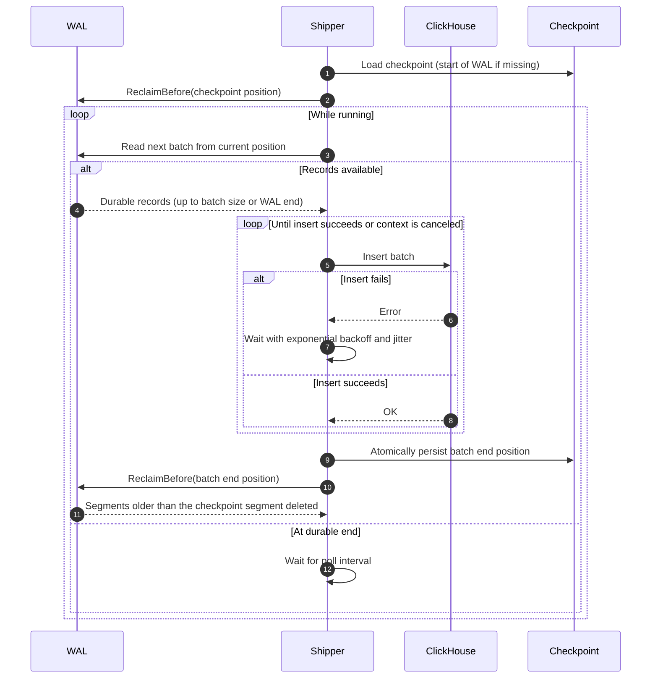

### Duplicate handling

A crash between a successful insert and the checkpoint write can cause the same batch to be inserted again after restart. The current schema uses `ReplacingMergeTree`, but deduplication is subject to ClickHouse merge behavior and does not make insertion exactly once.

### Schema

The adapter persists events into the existing `fairgate.events` table, which uses `ReplacingMergeTree`, monthly partitioning, and a 30-day TTL. Persisted fields include the producer ID, event timestamp, sequence number, index, event type, and payload. Refer to the schema definition in the repository for the exact columns, partition expression, and TTL clause.

## Roadmap

The roadmap lists planned work in dependency order. Items are subject to change.

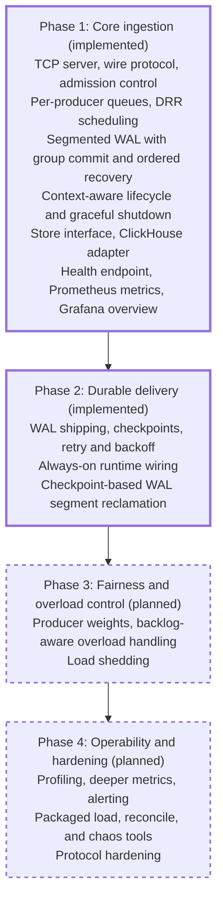

A solid border marks implemented work. Dashed borders mark planned work.

| Area | Status |
|---|---|
| Ingestion, validation, admission control | Implemented |
| Per-producer queues, DRR scheduling | Implemented |
| WAL append and recovery | Implemented |
| WAL segmentation and group commit | Implemented |
| Cross-segment recovery validation | Implemented |
| Sparse segment sets (discovery, recovery, reader) | Implemented |
| Context-aware lifecycle, connection tracking, graceful shutdown | Implemented |
| Cancelable enqueueing and scheduler error propagation | Implemented |
| `Store` interface, ClickHouse adapter | Implemented |
| Optional ClickHouse integration test | Implemented |
| Durable WAL reader and checkpoint-based batch shipping | Implemented |
| Durable checkpoints and retry with backoff | Implemented |
| Shipper runtime wiring and lifecycle | Implemented; shipper always runs |
| WAL segment reclamation | Implemented for segments older than the committed checkpoint segment |
| Docker image, Compose stack | Implemented |
| Health endpoint, basic Prometheus metrics, Grafana overview dashboard | Implemented |
| Producer weights and richer fairness controls | Planned |
| Backlog-aware overload handling | Planned |
| Profiling, deeper pipeline metrics, alerting | Planned |
| Packaged load generator, reconciliation, chaos tooling | Planned |
| Explicit queue-drain confirmation on shutdown | Planned |
| Protocol hardening (malformed and oversized frame handling) | Planned |

## Project structure

```text
FairGate/
├── internal/
│   ├── admit/       # Admission control
│   ├── sched/       # Producer queues and DRR scheduler
│   ├── server/      # TCP listener, connection handling, shipper lifecycle
│   ├── shipper/     # WAL reader loop, checkpoints, retry/backoff, reclamation trigger
│   ├── store/       # Storage interface and ClickHouse adapter
│   ├── wal/         # Segmented WAL, group commit, recovery, and reclamation
│   └── wire/        # Frame codec, event and ACK types
├── data/            # Local WAL data and checkpoint (runtime; do not commit)
├── Dockerfile
├── docker-compose.yml
├── install-docker-ubuntu.sh
├── go.mod
└── README.md
```

This reflects the current core packages. Additional packages and commands may be added as development continues.

## Getting started

### Requirements

- Go toolchain compatible with the version declared in `go.mod`
- Git
- Docker Engine and Docker Compose plugin for container deployment (the gateway always constructs a ClickHouse store, so running it outside tests needs a reachable ClickHouse; the Compose stack provides one)

### Installation

```bash
git clone https://github.com/PratyushVishal11011/Fairgate.git
cd Fairgate
go mod download
```

### Build and test

```bash
# Build all packages
go build ./...

# Run the test suite
go test ./...

# Run tests with the race detector
go test -race ./...
```

The graceful-shutdown tests use a no-op `Store` and a temporary checkpoint path, so the suite does not need a live ClickHouse service. The ClickHouse integration test runs only when its environment is configured.

The repository is being developed as a gateway implementation. A stable command-line interface and client SDK are planned. Check the repository's current entry point and configuration before attempting to launch a server, or use the Compose stack described in [Docker deployment](#docker-deployment).

## Docker deployment

The Compose stack starts the FairGate TCP server and its health and metrics endpoint, ClickHouse, Prometheus, and Grafana. Prometheus and Grafana use pinned image versions. FairGate waits for ClickHouse's health check before starting, Compose checks the gateway through `GET /health` on port `9100`, the shipper runs as part of the gateway (no enabling setting is needed), and the WAL and checkpoint persist in the `fairgate_wal` volume. As the shipper's checkpoint advances, older WAL segments in that volume are deleted automatically. Prometheus scrapes FairGate at `fairgate:9100`; Grafana automatically loads the Prometheus datasource and the FairGate Overview dashboard.

```bash
sudo docker compose up --build -d
sudo docker compose ps
sudo docker compose logs -f fairgate clickhouse
```

Open Grafana at [http://localhost:3001](http://localhost:3001) (default login `admin` / `admin`; change the password at first login). The standalone Next.js dashboard uses port `3000`. Prometheus is at [http://localhost:9090](http://localhost:9090); its host port is published for the remote dashboard, so restrict inbound TCP `9090` to trusted source addresses in the host firewall/security group. The gateway metrics endpoint is at [http://localhost:9100/metrics](http://localhost:9100/metrics), bound to loopback by default. `FAIRGATE_METRICS_ADDR` changes the gateway's metrics listener; if you change it, update the Compose port mapping and Prometheus target to match.

Published ports:

| Port | Service |
|---|---|
| `9001` | FairGate TCP ingestion (length-prefixed protocol, not HTTP) |
| `9100` | FairGate HTTP: `/health` and `/metrics` |
| `9000` | ClickHouse native protocol |
| `9090` | Prometheus |
| `3001` | Grafana |

For access from outside the host, if your `fairgate` port mapping is still bound to loopback, edit it in `docker-compose.yml` from the loopback-only binding to:

```yaml
ports:
  - "9001:9001"
```

Recreate the service after changing the mapping:

```bash
sudo docker compose up --build -d --force-recreate fairgate
```

Allow inbound TCP traffic on port `9001` through the host firewall, restricted to the client IP range that needs access. Connect to the host's reachable IP or DNS name on port `9001`; this is FairGate's length-prefixed TCP protocol, not an HTTP endpoint.

The Compose file uses development ClickHouse credentials. Replace them before exposing a non-development deployment. `docker compose down` keeps the named volumes; `docker compose down -v` removes them, including the WAL, checkpoint, and database data.

## Development status and limitations

FairGate is an experimental beta. Interfaces, protocol details, configuration, and storage semantics may change. The project has tests for implemented components, but its end-to-end durability and fairness goals still require broader load, crash-recovery, and downstream-outage validation.

Known limitations of the current beta:

- The gateway always constructs the ClickHouse store and starts the shipper; there is no mode that runs without storage. `FAIRGATE_SHIPPER_ENABLED` is no longer read.
- A crash after a successful database insert but before checkpoint commit can replay that batch. Storage therefore needs to tolerate duplicates; end-to-end exactly-once delivery is not guaranteed.
- WAL retention depends on the shipper. Reclamation advances only when a batch is inserted and its checkpoint committed, so while ClickHouse is unavailable, or a batch keeps failing and is retried, segments accumulate on disk.
- Reclamation deletes whole segments older than the checkpoint segment. The checkpoint and active segments are retained, so some already shipped records remain on disk until a later checkpoint passes them, and reclaimed records are no longer available for recovery replay or inspection.
- The ClickHouse integration test is optional and runs only when the environment is configured for it.
- Queue capacity, the admission rate and burst, the DRR quantum, the shutdown grace period, and the shipper's batch size, poll interval, and retry policy are fixed in the code and not yet configurable.
- All producers receive equal scheduling treatment. Weights are not yet supported.
- Enqueueing blocks on a full queue (cancelable during shutdown), and no load-shedding policy exists yet.
- A WAL write, rotation, or sync failure is fatal: later appends are rejected until the WAL is reopened.
- Startup recovery fails on an incomplete record in any non-final segment, rather than repairing it.
- Shutdown has no explicit queue-drain confirmation, and a handler stuck in an operation that ignores connection closure and context cancellation can delay it beyond the grace period.
- The Compose file ships with development credentials and publishes the FairGate, ClickHouse, Prometheus, and Grafana ports; restrict inbound access to trusted addresses as described in [Docker deployment](#docker-deployment) and replace the credentials before any non-development use.
- FairGate currently exposes a basic Prometheus metrics set (active connections, accepted, rejected and invalid events, WAL append errors, scheduler totals), a `/health` endpoint, and a provisioned Grafana overview dashboard. Profiling, per-stage latency metrics, queue-depth metrics, and shipper lag metrics are not available yet.

## Contributing

Issues, bug reports, design discussions, and pull requests are welcome. For substantial changes, open an issue first to discuss the proposed behavior or interface.

When contributing:

1. Keep core ingestion and scheduling independent of business-specific logic.
2. Prefer bounded memory and explicit backpressure.
3. Add tests for new behavior and failure paths.
4. Run `go test ./...` and `go test -race ./...` before submitting a pull request.

## License

FairGate is released under the [MIT License](LICENSE).